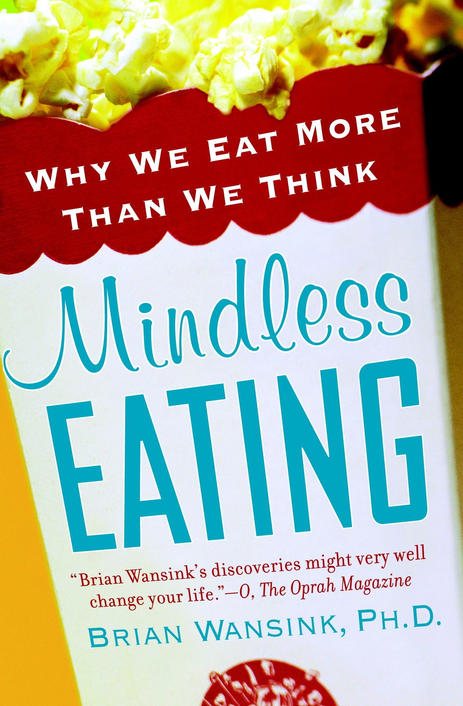
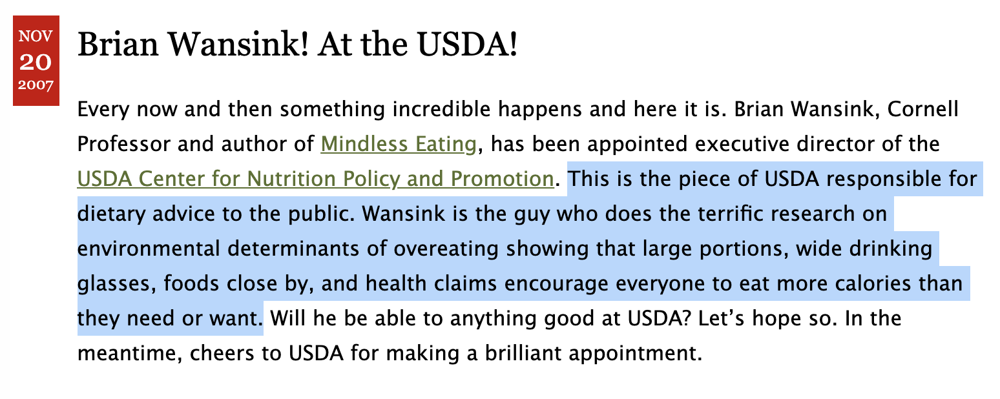

```{r setup, include=FALSE}
options(htmltools.dir.version = FALSE)
library(here)
library(DiagrammeR)
library(xaringan)
library(leaflet)
library(ggplot2)
library(emojifont)
```

```{r xaringan-themer, include=FALSE}
library(xaringanthemer)
style_xaringan(text_color = "#000000", header_color = "#737373", text_font_size = "24px",  text_font_family = "'Lucida Sans'", header_font_google = google_font("Source Sans Pro"), header_font_weight="lighter", title_slide_background_color =  "#ffffff", title_slide_text_color = "#000000", link_color = "#0000ee", footnote_font_size = "0.5em")
```

class: center, middle

# I am a social epidemiologist at McGill University.

# I [work](https://samharper.org) mainly on evaluating programs and policies on social inequalities in health.

# *I have nothing to disclose, other than a strong commitment to open science*

---
background-image: url(../images/wansink-bowl.png)
background-size: contain
class: inverse

--

.pull-left[

]

--
.pull-right[

]

---


.footnote[ https://www.foodpolitics.com/2007/11/brian-wansink-at-the-usda/]
