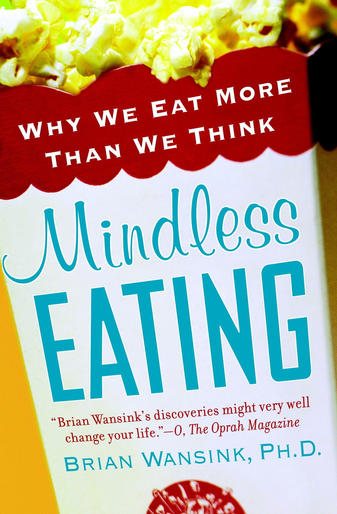
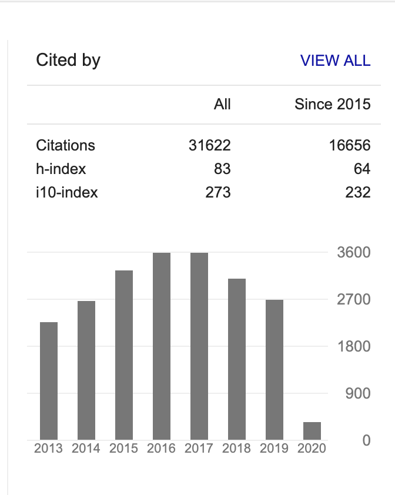
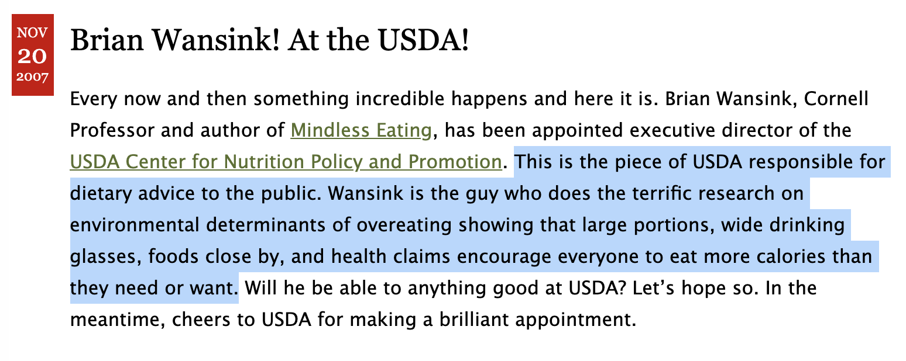
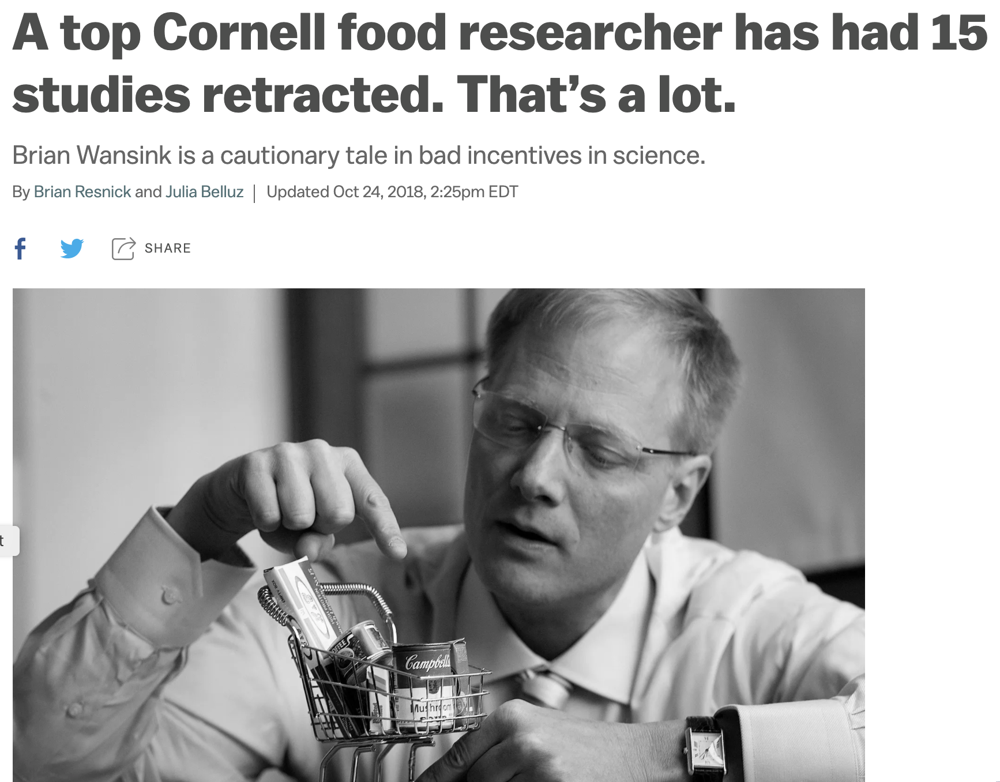
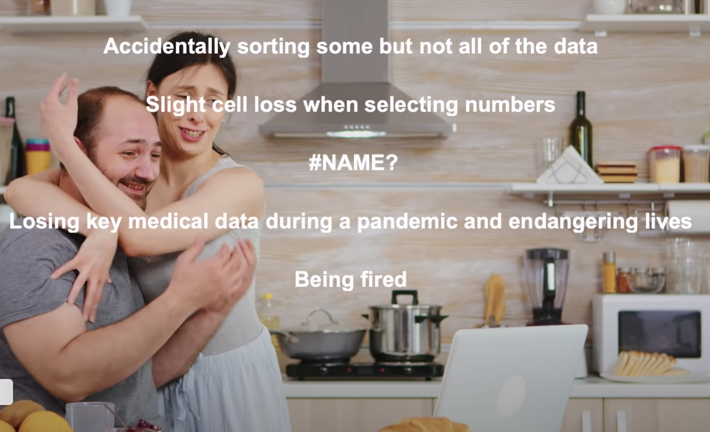

```{r setup, include=FALSE}
options(htmltools.dir.version = FALSE)
library(here)
library(DiagrammeR)
library(xaringan)
library(leaflet)
library(ggplot2)
library(emojifont)
```

```{r xaringan-themer, include=FALSE}
library(xaringanthemer)
style_xaringan(text_color = "#000000", header_color = "#737373", text_font_size = "24px",  text_font_family = "'Lucida Sans'", header_font_google = google_font("Source Sans Pro"), header_font_weight="lighter", title_slide_background_color =  "#ffffff", title_slide_text_color = "#000000", link_color = "#0000ee", footnote_font_size = "0.5em")
```

class: center, middle

# I am a social epidemiologist at McGill University.

# I [work](https://samharper.org) mainly on evaluating programs and policies on social inequalities in health.

# *I have nothing to disclose, other than a strong commitment to open science*

---
background-image: url(wansink-bowl.png)
background-size: contain
class: inverse

--

.pull-left[

]

--
.pull-right[

]

---


.footnote[ https://www.foodpolitics.com/2007/11/brian-wansink-at-the-usda/]

---
.footnote[Archived post [here](https://web.archive.org/web/20170312041524/http:/www.brianwansink.com/phd-advice/the-grad-student-who-never-said-no).]

.pull-left[
*"I gave her a data set of a self-funded, failed study which had .red[null results]... I said, ‘This cost us a lot of time and our own money to collect. There’s got to be something here we can salvage because it’s a cool (rich & unique) data set.’ I had three ideas for potential Plan B, C, & D directions (since Plan A had failed)."* -blog, 2016
]

---
.footnote[Archived post [here](https://web.archive.org/web/20170312041524/http:/www.brianwansink.com/phd-advice/the-grad-student-who-never-said-no).]

.pull-left[
*"I gave her a data set of a self-funded, failed study which had .red[null results]... I said, ‘This cost us a lot of time and our own money to collect. There’s got to be something here we can salvage because it’s a cool (rich & unique) data set.’ I had three ideas for potential Plan B, C, & D directions (since Plan A had failed)."* -blog, 2016

Enterprising grad students found:
- impossible values
- incorrect ANOVA results
- dubious p-values

Wansink denied requests for access to the original data.
]

--

.pull-right[


Wansink resigned from Cornell in 2019.
]

---
.footnote[ Boddy (2016), Ziemann (2016)]

.left-column[
Tools have consequences
.center[
*SEPT2* gene
## `r emo::ji("point_down")`

# `r emo::ji("point_down")`
2-Sep

]]

.right-column[
.center[

]]

---
# More recently...
.pull-left[


]

.pull-right[
Are Spreadsheets® right for you? Side effects may include:


]

.footnote[ Sources: The Guardian [(2020-10-06)](https://www.theguardian.com/politics/2020/oct/05/how-excel-may-have-caused-loss-of-16000-covid-tests-in-england), [YouTube](https://www.youtube.com/watch?v=aBoKwArgC3A)]

---
class: center, inverse

# .orange[**The integrity of science is compromised by non-reproducible research.**]

--

## .orange[There are tools to help you.]

---
# Setting expectations

.pull-left[
## Today is not about:
- Mastering software
- Learning to code
- Mastering version control
- Mastering statistical analysis
]

--

.pull-right[
## Today is about:
- *Why* to do reproducible research.
- Understanding concepts of *how* to do it.
- Getting familiar with tools to help.
- Learning where to find out more.
]

--

.center[# What is the plan?]

---

# Plan for today
## 1. Scientific Integrity Problems (1220h-1250h) `r emo::ji("coffee")`

## 2. Design Solutions (1300h-1330h)

## 3. Analytic Solutions (1330h-1350h, `r emo::ji("coffee")` 1400h-1450h `r emo::ji("coffee")`)

## 4. Dissemination Solutions (1500h-1530)

## 5. Reproducible Example (1530h-1600h)

---
# Code of Conduct
.pull-left[
## Do
- Be respectful.
- Ask questions in the chat.
- Use the 'raise your hand' feature to ask a question or make a comment.
- Interrupt me if I didn't notice your chat or 'hand'.
- Feel free to turn your camera on (if you are comfortable).
]

.pull-right[
## Don't
- Worry about taking notes (but feel free to do so). You will have access to all of the material for the workshop when we are finished.
- Be disrespectful or rude.
]

--
# .center[Let's go!]


