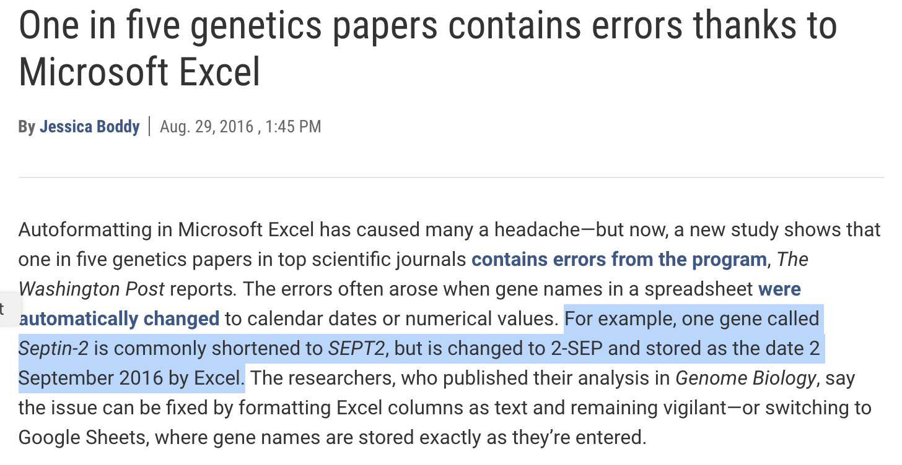

```{r setup, include=FALSE}
options(htmltools.dir.version = FALSE)
library(here)
library(DiagrammeR)
library(xaringan)
library(leaflet)
library(ggplot2)
library(emojifont)
```

```{r xaringan-themer, include=FALSE}
library(xaringanthemer)
style_xaringan(text_color = "#000000", header_color = "#737373", text_font_size = "24px",  text_font_family = "'Lucida Sans'", header_font_google = google_font("Source Sans Pro"), header_font_weight="lighter", title_slide_background_color =  "#ffffff", title_slide_text_color = "#000000", link_color = "#0000ee", footnote_font_size = "0.5em")
```

.pull-left[


]

.pull-right[

]


.footnote[ https://www.foodpolitics.com/2007/11/brian-wansink-at-the-usda/]

---
.pull-left[
*"I gave her a data set of a self-funded, failed study which had null results... I said, ‘This cost us a lot of time and our own money to collect. There’s got to be something here we can salvage because it’s a cool (rich & unique) data set.’ I had three ideas for potential Plan B, C, & D directions (since Plan A had failed)."*
]

.pull-right[

]

---
.pull-left[
*"I gave her a data set of a self-funded, failed study which had null results... I said, ‘This cost us a lot of time and our own money to collect. There’s got to be something here we can salvage because it’s a cool (rich & unique) data set.’ I had three ideas for potential Plan B, C, & D directions (since Plan A had failed)."*

Enterprising grad students found:
- impossible values
- incorrect ANOVA results
- dubious p-values

Requests for access to the original data were denied by Wansink.
]

.pull-right[

]

---
class: center, top

# *SEPT2* gene

--
# `r emo::ji("point_down")`


--

# `r emo::ji("point_down")`

# 2-Sep

---
# Modern scientific tools have consequences
.pull-left[

]

.pull-right[

]


.footnote[ Boddy (2016), Ziemann (2016)]

---
# More recently...
.pull-left[


]

.pull-right[
Are Spreadsheets® right for you? Side effects may include:


]


.footnote[ Sources: The Guardian [(2020-10-06)](https://www.theguardian.com/politics/2020/oct/05/how-excel-may-have-caused-loss-of-16000-covid-tests-in-england), [YouTube](https://www.youtube.com/watch?v=aBoKwArgC3A)]
---
class: center, inverse

# .orange[**The integrity of science is compromised by non-reproducible research.**]

--

## .orange[There are tools to help you.]

---
# Setting expectations

.pull-left[
## Today is not about:
- Mastering software
- Mastering version control
- Mastering statistical analysis
]

--

.pull-right[
## Today is about:
- *Why* to do reproducible research.
- Understanding concepts of *how* to do it.
- Learning where to find out more.
]

--

# What is the plan?

---

# Plan for today
## 1. Scientific Integrity Problems

## 2. Design Solutions

## 3. Analytic Solutions

## 4. Dissemination Solutions

## 5. Reproducible Example

