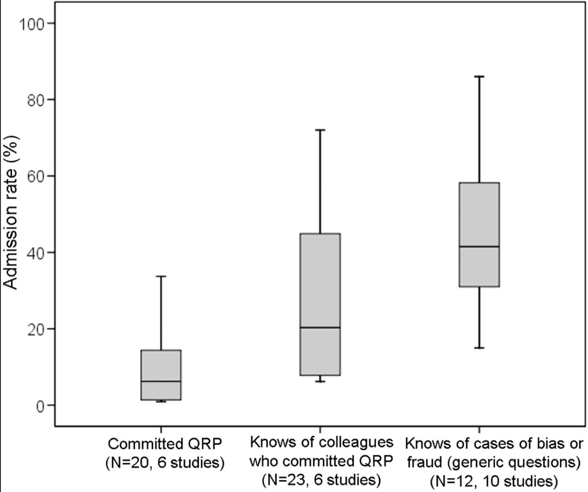
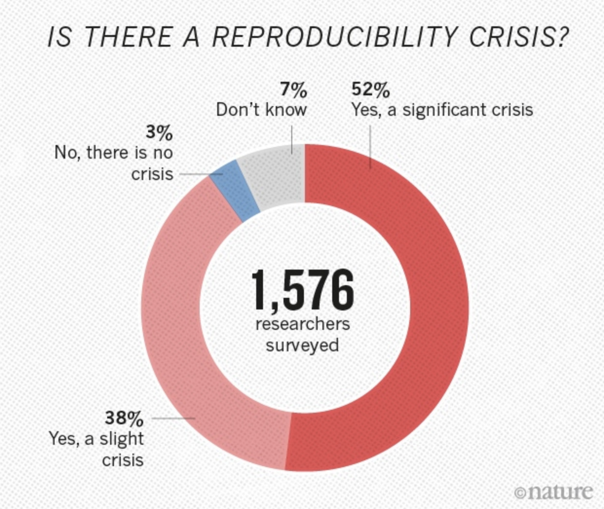
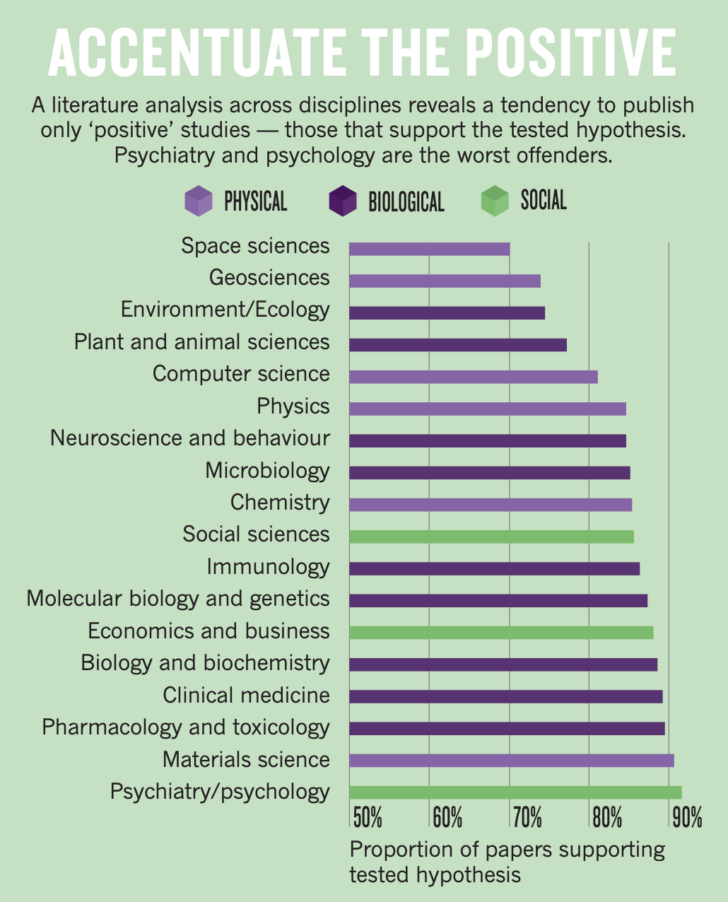
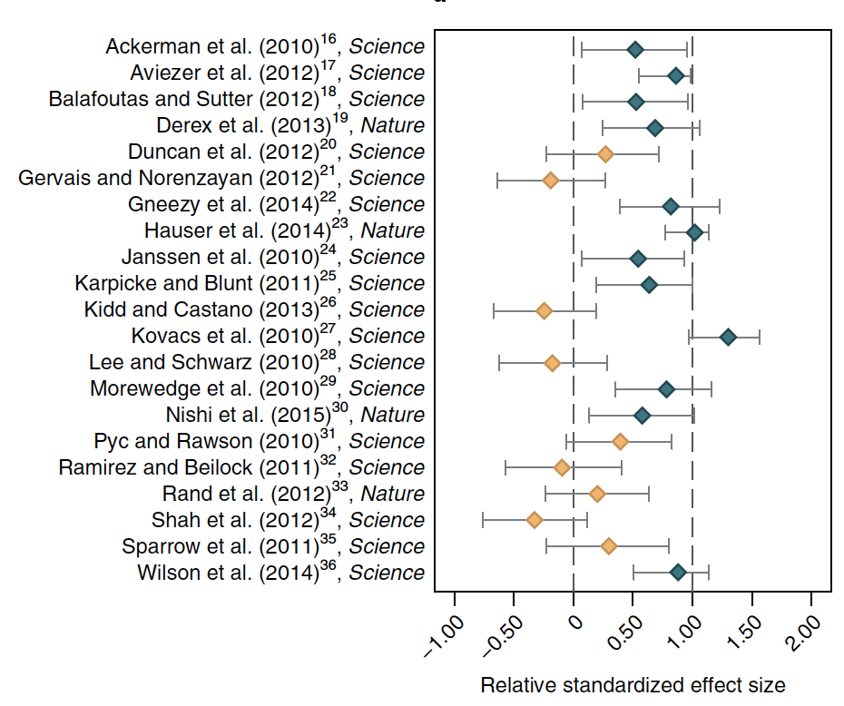
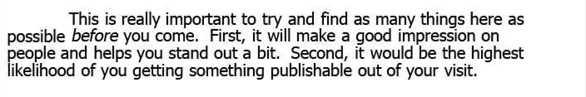

```{r setup, include=FALSE}
options(htmltools.dir.version = FALSE)
library(here)
library(DiagrammeR)
library(xaringan)
library(leaflet)
library(ggplot2)
library(emojifont)
library(countdown)
xfun::pkg_load2(c('tikzDevice', 'magick', 'pdftools'))
```

```{r, include=FALSE}
pdf2png = function(path) {
  # only do the conversion for non-LaTeX output
  if (knitr::is_latex_output()) return(path)
  path2 = xfun::with_ext(path, "png")
  img = magick::image_read_pdf(path)
  magick::image_write(img, path2, format = "png")
  path2
}
```

```{r xaringan-themer, include=FALSE}
library(xaringanthemer)
style_xaringan(text_color = "#000000", header_color = "#737373", text_font_size = "24px",  text_font_family = "'Lucida Sans'", header_font_google = google_font("Source Sans Pro"), header_font_weight="lighter", title_slide_background_color =  "#ffffff", title_slide_text_color = "#000000", link_color = "#0000ee", footnote_font_size = "0.5em")
```

class: center, top, inverse
# .orange[**1. Scientific Integrity Problems**]

--

.left[
## .orange[**1.1 Mertonian norms**]
## .orange[**1.2 Significance testing**]
## .orange[**1.3 Non-replication**]
## .orange[**1.4 Incentive structure**]
]

---
class: center, top, inverse
# .orange[**1. Scientific Integrity Problems**]

.left[
## .orange[**1.1 Mertonian norms**]
## .gray[**1.2 Significance testing**]
## .gray[**1.3 Non-replication**]
## .gray[**1.4 Incentive structure**]
]

---
# Mertonian Norms in Science
.pull-left[
### Core Values of Scientific Research
1. Universalism

2. Communality

3. Disinterestedness

4. Organized Skepticism
]

.pull-right[

]

.footnote[ Merton (1942), Christensen et al. (2019)]

---
.pull-left[
### Norms
- *Universalism*: Evaluate research only on its merit.

- *Communality*: Openly share new findings.

- *Disinterestedness*: Motivated by the desire for knowledge and discovery.

- *Skepticism*: Consider all new evidence, hypotheses, theories, and innovations, even those that challenge or contradict their own work.
]

--

.pull-right[
### Counternorms
- *Particularism*: New knowledge from reputation or group.

- *Secrecy*: Protect own findings for private gain.

- *Self-interestedness*: Colleagues are competitors.

- *Dogmatism*: Protecting one's own findings, resisting alternatives.
]

---
## Potential sources of "bias" in published research
.pull-left[
### Usual explanations
#### Confounding, measurement error, selection bias, model misspecification, etc.
]

--

.pull-right[
### Problems with integrity
#### • Fraud/data manipulation/fabrication.
#### • Poor design / inadequate power.
#### • NHST: Publication bias.
#### • NHST: P-hacking.
#### • Financial ties/ideological commitments.
#### • Careerism.
#### • Lack of transparency.
]

---
class: center
Affects the entire research lifecycle
.footnote[ Munafo et al. (2017)]
```{r,  echo=F, out.width = 900}
knitr::include_graphics("munafo-figure.png")
```

---
class: center, top, inverse
# .background[x]

# .orange[**How do we know that science isn't working?**]

--

# .orange[**Ask scientists.**]

---
.footnote[ Christensen et al. (2019) surveyed 3247 US researchers funded by NIH]
.left-column[
.right[
### Norm support:
### "In theory"
#### .white[x]
### "Me"
####.white[x]
### .blue["Others"]
]]

.right-column[

]

---
.footnote[Fanelli *PLoS ONE* (2011)]
.left-column[
### Scientists admit to engaging in questionable research practices.


]
.right-column[
.center[

]]

---
.footnote[Baker *Nature* (2018)]
.left-column[
## Scentists think there is a "reproducibility" crisis

### or a "slight" crisis?  `r emo::ji("thinking_face")`
]
.right-column[
.center[

]]

---
class: center, top, inverse
# .orange[**1. Scientific Integrity Problems**]

.left[
## .gray[**1.1 Mertonian norms**]
## .orange[**1.2 Significance testing**]
## .gray[**1.3 Non-replication**]
## .gray[**1.4 Incentive structure**]
]
---
.pull-left[
## A lot of irreproducible or unreliable research stems from Null Hypothesis Significance Testing (NHST).
]

.pull-right[

]

.footnote[ https://mobile.twitter.com/wviechtb/status/1228327958810648576/photo/1]

---
### Researcher "degrees of freedom" are difficult to control
.footnote[ Source: Gary King]

.pull-left[
### How are analyses conducted?
- collect the data over many months.
- finish recording and merging.
- run *one* regression.
- new regression, different controls.
- now a different functional form.
- new regression, different measures.
- yet another regression on subset.
- have 100 or 1000 estimates.
- 1 or maybe 5 results in the paper.
]

--

.pull-right[
### What's the problem?
- Some result is designated as the “correct” one, only *after* looking
at the estimates.

- Is this a true test of a hypothesis or just confirmation bias?

- This is "p-hacking"
]

---


.footnote[ Source: [fivethirtyeight.com](https://projects.fivethirtyeight.com/p-hacking/)]

---
# Let's do some hacking!

## Go to https://projects.fivethirtyeight.com/p-hacking/ and answer this question:

--

.center[
# .orange[**Will next week's election affect the economy?**]
]

```{r, echo=F}
countdown(minutes = 3)
```

---
background-image: url(hacking-result.png)
background-size: contain

---
background-image: url(hacking-result2.png)
background-size: contain

---
## How NHST facilitates non-replication
.footnote[ Lash (2017)]
.left-column[

.red[Study results are sampled from the (---) distribution, but we only see 'statistically significant' ones ]

]
.right-column[
.center[

]]


---
.left-column[
.footnote[ https://www.ahajournals.org/doi/abs/10.1161/jaha.116.004880]
### How do we know there is p-hacking?
(1) Look at what people are doing.
]

.right-column[
Two estimates:
- HR=0.90, 95%CI: 0.81, 0.99    .blue["Significantly lower"]
- HR=0.89, 95%CI: 0.78, 1.00009 .red["No difference"]

````{r, echo=F, out.width=700}
knitr::include_graphics("aha-ns.jpeg")
```
]
---
.left-column[
.footnote[ Chavalarais et al. (2013)]
### How do we know there is p-hacking?
(2) Seriously, everything is significant
]

.right-column[
P-values in the biomedical literature, 1990-2015
````{r, echo=F, out.width=700}
knitr::include_graphics("chavalarais-fig3.png")
```
]

---
.left-column[
.footnote[ Gotzsche (2006)]
### How do we know there is p-hacking?
(3) Maldistribution of published p-values

True for medicine, economics, psychology, political science, many other disciplines.
]

.right-column[
P-values from 260 RCTs
````{r, echo=F, out.width=700}
knitr::include_graphics("gotzsche.png")
```
]

---
.left-column[
.footnote[ data from Barnett and Wren [(2019)](https://bmjopen.bmj.com/content/bmjopen/9/11/e032506.full.pdf)]
### Won't 95% confidence intervals help?
No.

Researchers still dichotomize them.
]

.right-column[
.center[Nearly 1,000,000 95% CIs from PubMed:]
````{r, echo=F, out.width=700}
knitr::include_graphics("wren-cis.png")
```
]

---
class: middle, center
# NHST also leads to missing evidence and publication bias

---
.footnote[ Turner et al. *NEJM* [(2008)](https://www.nejm.org/doi/full/10.1056/nejmsa065779)]

.left-column[
###  Missing evidence
Negative studies of antidepressents less likely to be published. 

Impacts regulatory decisions.
]

.right-column[
.center[


]]

---
.footnote[Fanelli *PLoS ONE* (2010), Yong *Nature* [(2012)](https://www.nature.com/news/replication-studies-bad-copy-1.10634)]

.pull-left[
## .orange[Publication bias affects nearly all disciplines]
### Statistically significant results are more likely to be published, across virtually all disciplines.
### May be worse in "softer" sciences.
### Much of the bias is likely self-imposed.
]

.pull-right[
.center[

]]

---
.footnote[ Figure from Mervis in Science 29 Aug 2014;345:992]

.left-column[
### Self-imposed by many researchers
221 survey experiments funded by US NSF.

All peer reviewed, required to be deposited in a registry.

All studies had results.
]

--

.right-column[
.center[

]]

---
class: center, top, inverse
# .orange[**1. Scientific Integrity Problems**]

.left[
## .gray[**1.1 Mertonian norms**]
## .gray[**1.2 Significance testing**]
## .orange[**1.3 Non-replication**]
## .gray[**1.4 Incentive structure**]
]

---
## Distinctions between commonly used terms
.footnote[ National Academy of Sciences (2019)]
.pull-left[
### Replication
Using using independent investigators, methods, data, equipment, and protocols, we arrive at the same conclusions and/or the same estimate of the effect.

.blue[There can be good reasons why findings do not replicate.]

]

--

.pull-right[
### Reproducibility
If we start from the *same* data gathered by the scientist we can reproduce the same results, p-values, confidence intervals, tables and figures as in the original report.

.red[There are fewer reasons for non-reproducibility.]

]
---
### Large scale efforts to replicate studies are not reassuring
.footnote[ Nosek et al. (2017), Camerer et al. (2016)]

.pull-left[
#### In Psychology
```{r,  echo=F, out.width = 650}
knitr::include_graphics("nosek-abstract.png") 
```
]

.pull-right[
#### In Economics
```{r,  echo=F, out.width = 650}
knitr::include_graphics("camerer-abstract.png") 
```
]

---
.footnote[ Nosek et al. (2017)]

.left-column[
### Effect sizes are much lower in replication studies.
]
.right-column[
```{r,  echo=F, out.width = 650}
knitr::include_graphics("nosek-fig.png") 
```
]

---
## Surely the "top" journals are better, right?
.footnote[ Camerer et al. [(2018)](https://www.nature.com/articles/s41562-018-0399-z)]

.pull-left[
"We find a significant effect in the same direction as the original study for 13 (62%) studies, and the effect size of the replications is on average about 50% of the original effect size"

"The relative effect size of true positives is estimated to be 71%, suggesting that both .red[false positives and inflated effect sizes] of true positives contribute to imperfect reproducibility."
]
.pull-right[

]

---
# What about peer review?
.pull-left[
### Peer review is:
- Slow, inefficient, and expensive.

- Reviewers agreement no better than chance.

- Does not detect errors.
]

.pull-right[
### Reviewiers are biased against:
- Less prestigious institutions.

- Against new or original ideas.
]

.footnote[ Smith (2010), editor at *BMJ* for many years.]


---
### If we wanted to reproduce, often the materials aren't there
.center[
```{r, echo=F, out.width=700}
knitr::include_graphics("mol-brain.png")
```
]

.footnote[ Miyakawa *Molecular Brain* (2020) 13:24]

---
.pull-left[
### Even with data, efforts to reproduce are </br> rarely successful
Gertler et al. gathered replication materials from published papers in econ.

Most authors only included estimation code.

*Estimation code* only ran in 40% of cases.


]

.pull-right[

]

.footnote[ Gertler et al. 2018]

---
class: center, top, inverse
# .orange[**1. Scientific Integrity Problems**]

.left[
## .gray[**1.1 Mertonian norms**]
## .gray[**1.2 Significance testing**]
## .gray[**1.3 Non-replication**]
## .orange[**1.4 Incentive structure**]
]

---
## Incentive problems
.right-column[
### Reward structure
#### Papers, grants, media, "novel" and "significant" results.
### Incentives
#### Gift authorship, CV padding, salami-slicing
#### Overstating claims, ignoring "non-significant" results, p-hacking
#### Hoarding data, non-transparent materials and methods
]

---
## Incentive problems
### Remember Brian Wansink?
### After encouraging his postdoc to "find" specific results, fish for interactions, change the dependent variable, and eliminate outliers, he concluded:

.center[

]

---
# Summary points
## Science is conducted by humans.
## Many counternorms exist that undermine scientific integrity.

--

.center[
## .orange[What can we do about it?]
]

---
### A reproducible path forward: Reminaging the research lifecycle?


.footnote[ Policy Design & Evaluation Lab (2017)]

---
class: center, top, inverse
# .orange[**Break!**] `r emo::ji("coffee")`
```{r, echo=F}
countdown(minutes = 10, 
          left = 0, right = 0, bottom = "15%", top = "15%",
          padding = "50px",
          margin = "5%",
          font_size = "7em",
          color_text= '#f5bc6c')
```