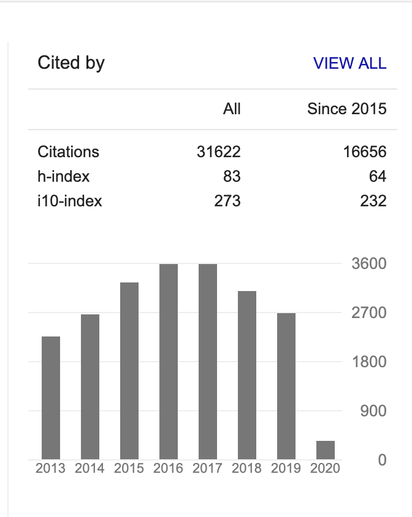

```{r setup, include=FALSE}
options(htmltools.dir.version = FALSE)
library(here)
library(DiagrammeR)
library(xaringan)
library(leaflet)
library(ggplot2)
library(emojifont)
xfun::pkg_load2(c('tikzDevice', 'magick', 'pdftools'))
```

```{r, include=FALSE}
pdf2png = function(path) {
  # only do the conversion for non-LaTeX output
  if (knitr::is_latex_output()) return(path)
  path2 = xfun::with_ext(path, "png")
  img = magick::image_read_pdf(path)
  magick::image_write(img, path2, format = "png")
  path2
}
```

```{r xaringan-themer, include=FALSE}
library(xaringanthemer)
style_xaringan(text_color = "#000000", header_color = "#737373", text_font_size = "24px",  text_font_family = "'Lucida Sans'", header_font_google = google_font("Source Sans Pro"), header_font_weight="lighter", title_slide_background_color =  "#ffffff", title_slide_text_color = "#000000", link_color = "#0000ee", footnote_font_size = "0.5em")
```

class: center, middle, inverse
# .orange[**1. Integrity Problems**]


---

.pull-left[


]

.pull-right[

]


.footnote[ https://www.foodpolitics.com/2007/11/brian-wansink-at-the-usda/]

---
.pull-left[
*"I gave her a data set of a self-funded, failed study which had null results... I said, ‘This cost us a lot of time and our own money to collect. There’s got to be something here we can salvage because it’s a cool (rich & unique) data set.’ I had three ideas for potential Plan B, C, & D directions (since Plan A had failed)."*
]

.pull-right[

]

---
.pull-left[
*"I gave her a data set of a self-funded, failed study which had null results... I said, ‘This cost us a lot of time and our own money to collect. There’s got to be something here we can salvage because it’s a cool (rich & unique) data set.’ I had three ideas for potential Plan B, C, & D directions (since Plan A had failed)."*

Enterprising grad students found:
- impossible values
- incorrect ANOVA results
- dubious p-values

Requests for access to the original data were denied by Wansink.
]

.pull-right[

]

---
# Modern scientific tools have consequences
.pull-left[

]

.pull-right[

]


.footnote[ Boddy (2016), Ziemann (2016)]

---
# More recently...
.pull-left[


]

.pull-right[
Are Spreadsheets® right for you? Side effects may include:


]


.footnote[ Sources: The Guardian [(2020-10-06)](https://www.theguardian.com/politics/2020/oct/05/how-excel-may-have-caused-loss-of-16000-covid-tests-in-england), [YouTube](https://www.youtube.com/watch?v=aBoKwArgC3A)]
---
class: center
# The integrity of science is compromised by non-reproducible research.

--

## There are tools to help you.

---

# Plan for today
## 1. Scientific Integrity Problems

## 2. Design Solutions

## 3. Analytic Solutions

## 4. Dissemination Solutions

## 5. Reproducible Example

---
class: center, middle, inverse
# .orange[**1. Scientific Integrity Problems**]

---
# Mertonian Norms in Science
.pull-left[
### Core Values of Scientific Research
1. Universalism

2. Communality

3. Disinterestedness

4. Organized Skepticism
]

.pull-right[

]

.footnote[ Merton (1942), Christensen et al. (2019)]

---
.pull-left[
### Norms
- *Universalism*: Evaluate research only on its merit.

- *Communality*: Openly share new findings.

- *Disinterestedness*: Motivated by the desire for knowledge and discovery.

- *Skepticism*: Consider all new evidence, hypotheses, theories, and innovations, even those that challenge or contradict their own work.
]

.pull-right[
### Counternorms
- *Particularism*: New knowledge from reputation or group.

- *Secrecy*: Protect own findings for private gain.

- *Self-interestedness*: Colleagues are competitors.

- *Dogmatism*: Protecting one's own findings.
]

---
.footnote[ Christensen et al. (2019)]
.left-column[
### Scientists subscribe to norms, but think others exhibit counternorms.

(Surveyed 3247 US researchers funded by NIH)
]
.right-column[

]
---
## Potential sources of bias in published research
.pull-left[
### Usual culprits
- Uncontrolled confounding

- Selection bias

- Measurement error

- Model misspecification, etc.
]

.pull-right[
### Problems with integrity
- Fraud/manipulation/fabrication

- NHST: Publication bias

- NHST: P-hacking

- Conflicts of interest

- Careerism

- Broken peer review

- Lack of transparency
]

---
class: center
.footnote[ Munafo et al. (2017)]
```{r,  echo=F, out.width = 900}
knitr::include_graphics("munafo-figure.png")
```

---
### Retractions still rare relative to published papers, but increasing.
.center[
```{r, echo=F, out.width=800}
knitr::include_graphics("steen-2013.png")
```
]
.footnote[ Steen et al. 2013]

---
.pull-left[
# A lot of irreproducible or unreliable research stems from Null Hypothesis Significance Testing
]

.pull-right[

]


.footnote[ https://mobile.twitter.com/wviechtb/status/1228327958810648576/photo/1]

---
### How NHST facilitates non-replication
.footnote[ Lash (2017)]
.left-column[

.red[Study results are sampled from the (---) distribution, but we only see 'statistically significant' ones ]

]
.right-column[

]


---
.left-column[
.footnote[ https://www.ahajournals.org/doi/abs/10.1161/jaha.116.004880]
### How do we know there is p-hacking?
(1) Look at what people are doing.
]

.right-column[
Two estimates:
- HR=0.90, 95%CI: 0.81, 0.99    .blue["Significantly lower"]
- HR=0.89, 95%CI: 0.78, 1.00009 .red["No difference"]

````{r, echo=F, out.width=700}
knitr::include_graphics("aha-ns.jpeg")
```
]
---
.left-column[
.footnote[ Chavalarais et al. (2013)]
### How do we know there is p-hacking?
(2) Everything is significant
]

.right-column[
P-values in the biomedical literature, 1990-2015
````{r, echo=F, out.width=700}
knitr::include_graphics("chavalarais-fig3.png")
```
]

---
.left-column[
.footnote[ Gotzsche (2006)]
### How do we know there is p-hacking?
(3) Maldistribution of published p-values

True for medicine, economics, psychology, political science, many other disciplines.
]

.right-column[
P-values from 260 RCTs
````{r, echo=F, out.width=700}
knitr::include_graphics("gotzsche.png")
```
]

---
.left-column[
.footnote[ Barnett and Wren [(2019)](https://bmjopen.bmj.com/content/bmjopen/9/11/e032506.full.pdf)]
### Won't 95% confidence intervals help?
No.

Researchers still dichotomize them.
]

.right-column[
.center[Nearly 1,000,000 95% CIs from PubMed:]
````{r, echo=F, out.width=700}
knitr::include_graphics("wren-cis.png")
```
]

---
### Researcher "degrees of freedom" are difficult to control
.footnote[ Source: Gary King]

.pull-left[
### How are analyses conducted?
- collect the data over many months.
- finish recording and merging.
- run *a* regression.
- new regression, different controls.
- new regression, different functional forms.
- new regression, different measures.
- yet another regression on subset.
- have 100 or 1000 estimates.
- 1 or maybe 5 results in the paper.
]

--

.pull-right[
### What's the problem?
- Some result is designated as the “correct” one, only *after* looking
at the estimates.

- Is this a true test of a hypothesis or just confirmation bias?
]

---
## Hypothesizing After the Results are Known (HARKing)

.left-column[
- Pretending what you found was what you were looking for.

- Easy to "find" theory / biological evidence consistent with results.
]

.right-column[

]
.footnote[ *New Yorker*, 2014-12-07]

---


.footnote[ Source: [fivethirtyeight.com](https://projects.fivethirtyeight.com/p-hacking/)]

---
class: middle, center
# NHST also leads to missing evidence and publication bias

---
.footnote[ Turner et al. (2008)]

.left-column[
###  Missing evidence
Negative studies of antidepressents less likely to be published. 

Impacts regulatory decisions.
]

.right-column[
.center[
```{r, echo=F, out.width=600}
knitr::include_graphics("turner-nejm-fig.png")
```
]]

---
.footnote[ Figure from Mervis in Science 29 Aug 2014;345:992]

.left-column[
### Self-imposed by many researchers
221 survey experiments funded by US NSF.

All peer reviewed, required to be deposited in a registry.

All studies had results.
]

.right-column[
.center[

]]

---
## Distinctions between commonly used terms
.footnote[ National Academy of Sciences (2019)]
.pull-left[
### Replication
Using using independent investigators, methods, data, equipment, and protocols, we arrive at the same conclusions and/or the same estimate of the effect.

.blue[There can be good reasons why findings do not replicate.]

]

--

.pull-right[
### Reproducibility
If we start from the *same* data gathered by the scientist we can reproduce the same results, p-values, confidence intervals, tables and figures as those in the original report.

.red[There are fewer reasons for non-reproducibility.]

]
---
### Large scale efforts to replicate studies are not reassuring
.pull-left[
#### In Psychology
```{r,  echo=F, out.width = 650}
knitr::include_graphics("nosek-abstract.png") 
```
]

.pull-right[
#### In Economics
```{r,  echo=F, out.width = 650}
knitr::include_graphics("camerer-abstract.png") 
```
]


.footnote[ Nosek et al. (2017), Camerer et al. (2016)]

---
.center[
```{r,  echo=F, out.width = 650}
knitr::include_graphics("nosek-fig.png") 
```
]
.footnote[ Nosek et al. (2017)]


---
### If we wanted to reproduce, often the materials aren't there
.center[
```{r, echo=F, out.width=700}
knitr::include_graphics("mol-brain.png")
```
]

.footnote[ Miyakawa *Molecular Brain* (2020) 13:24]

---
.pull-left[
### Even with data, efforts to reproduce are </br> rarely successful
Gertler et al. gathered replication materials from published papers in econ.

Most authors only included estimation code.

*Estimation code* only ran in 40% of cases.


]

.pull-right[

]

.footnote[ Gertler et al. 2018]

---
# What about peer review?
.pull-left[
### Peer review is:
- Slow, inefficient, and expensive.

- Reviewers agreement no better than chance.

- Does not detect errors.
]

.pull-right[
### Reviewiers are biased against:
- Less prestigious institutions.

- Against new or original ideas.
]

.footnote[ Smith (2010), editor at *BMJ* for many years.]

---
### A reproducible path forward: Reminaging the research lifecycle?


.footnote[ Policy Design & Evaluation Lab (2017)]

---
# Summary points

