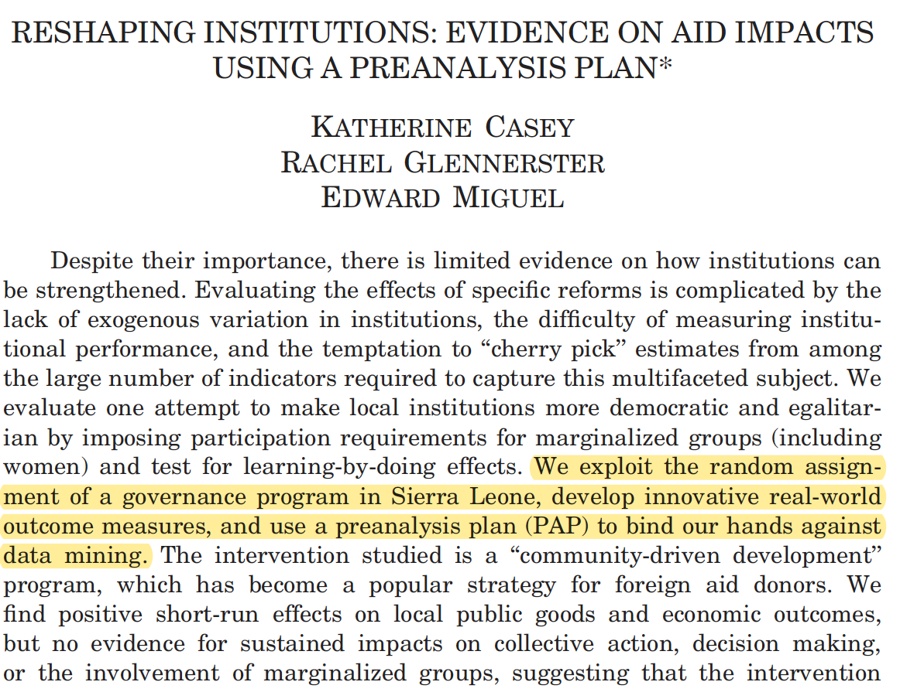
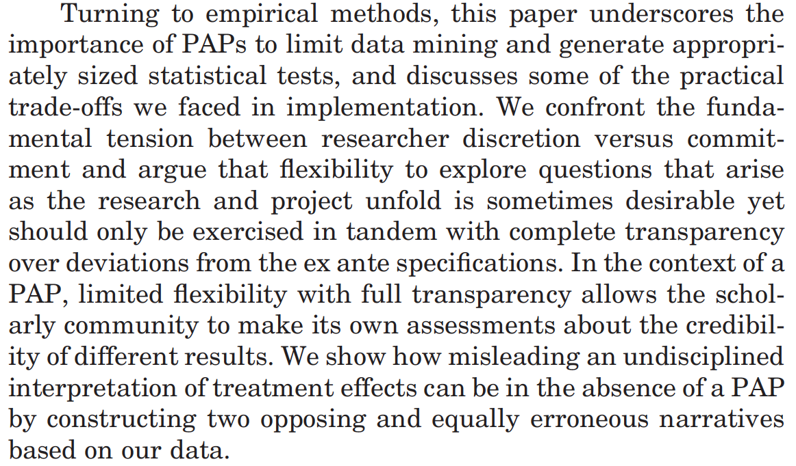
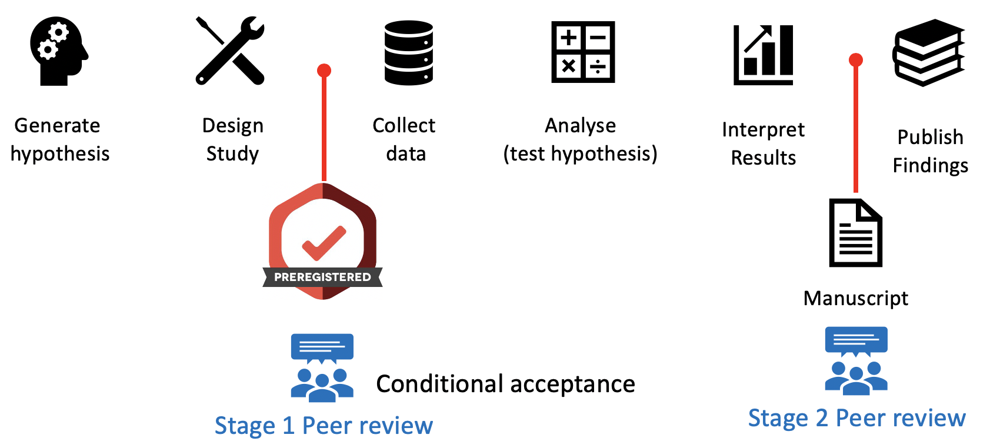

```{r setup, include=FALSE}
options(htmltools.dir.version = FALSE)
library(DiagrammeR)
library(xaringan)
library(leaflet)
library(ggplot2)
library(emo)
library(emojifont)
library(fontawesome)
xfun::pkg_load2(c('tikzDevice', 'magick', 'pdftools'))
```

```{r, include=FALSE}
pdf2png = function(path) {
  # only do the conversion for non-LaTeX output
  if (knitr::is_latex_output()) return(path)
  path2 = xfun::with_ext(path, "png")
  img = magick::image_read_pdf(path)
  magick::image_write(img, path2, format = "png")
  path2
}
```

```{r xaringan-themer, include=FALSE}
library(xaringanthemer)
write_xaringan_theme(text_color = "#000000", header_color = "#737373", text_font_size = "24px",  text_font_family = "'Lucida Sans'", header_font_google = google_font("Source Sans Pro"), title_slide_background_color =  "#ffffff", title_slide_text_color = "#000000", link_color = "#0000ee", footnote_font_size = "0.5em")
```

class: center, middle, inverse
# .orange[**2. Design Solutions**]

---
class: middle, center
# 2.1 Pre-registration

---
# What is study preregistration?
.left-column[
### A detailed research plan that is:
]

.right-column[
### Time stamped
#### Records and publicizes time and date


### Read-only
#### Can't be modified

### Registered prior to data collection
#### Robust to fieldwork
]

---
# What is preregistration?
.left-column[
```{r, echo=F}
knitr::include_graphics("preregistered_large_color.png")
# ggplot() + geom_fontawesome("fa-pencil-square-o", color='steelblue') + theme_void()
```
]

.right-column[
Common / required for publishing most RCTs

Controversial for observational studies.

Idea is to help *reduce publication bias*, since registered studies may be followed over time.

No guarantee anyone will publish.

Also can provide intellectual provenance of your ideas and hypotheses.

Good for planning and hypothesizing, .red[not a straightjacket.]
]

---
# Why preregistration?
1. It's *not* about minimizing Type 1 errors.
- Allowing others to transparently evaluate the credibility of the analysis
- Preventing "file drawer" problems.

---
# Why not preregistration?
- Observational studies are hard.
- Manuscripts may adhere to registrations rather than reality.
- Prespecification is irrelevant to the credibility of inference.
- Severe tests of hypotheses are more important than prespecification.
- 

.footnote[Lash and Vandenbroucke, *Epidemiology* [(2012)](https://doi.org/10.1097/EDE.0b013e318245c05b)]

---
# Where can you pre-register your study?
.left-column[
```{r, echo=F}
knitr::include_graphics("preregistered_large_color.png")
# ggplot() + geom_fontawesome("fa-pencil-square-o", color='steelblue') + theme_void()
```
]

.right-column[
Many different disciplinary “registries”
- AEA
- Clinicaltrials.gov, etc...
]

---
.footnote[ Kaplan and Irwin (2015)]

.left-column[
In 2000 NHLBI required the registration of primary outcome on ClinicalTrials.gov for all their grant-funded activity.

Increase in "null" findings.
]

.right-column[
```{r, echo=F, out.width=600, out.height=600}
knitr::include_graphics("kaplan-plos.png")
```
]

---
# Writing up pre-registered studies

## 1. Include a link to the registration 
## 2. Report *all* pre-registered results.
## 3. Explain and justify deviations.
## 4. Non-registered analyses named "exploratory", etc.

---
class: middle, center
# 2.2 Pre-analysis plans

---
# What is a pre-analysis plan?
.left-column[
```{r, echo=F}

# ggplot() + geom_fontawesome("fa-pencil-square-o", color='steelblue') + theme_void()
```
]

.right-column[
- Detailed description of research design and data analysis plans, submitted to a registry before looking at the data.

- Helps to tie your hands for data analysis (address researcher degrees of freedom, etc.)

- Distinguish between confirmatory and exploratory analysis

- Increases the credibility of research

- Transparent methods make it easier for others to build on your work
]

---
## What goes into a pre-analysis plan?

.pull-left[
- General info (Title, PIs, Staff)

- Introduction and Summary

- Study Design:
  - Hypotheses
  - Main variables
  - Study setting.
  - Intervention components.
  - Data collection methods.
  - Treatment assignment mechanism.
  - Power calculations.
]

.pull-right[
- Analytical decisions
  - models
  - derived variables
  - clustering
  - multiple testing
  
- Threats/mitigation/robustness checks.
]

---
# Example from development economics
.pull-left[

]

.pull-right[
### Conclusions:

]

.footnote[ Casey et al. (2012)]

---
## Early evidence from psychology

.left-column[
Particularly interesting that >50% of findings for 'novel' studies are consistent with the null.

.footnote[ Allen et al. (2019)]
]

.right-column[

]

---
## Potentially more useful: .red[Registered Reports]


.footnote[ Lee (2019)]

---
