```{r setup, include=FALSE}
options(htmltools.dir.version = FALSE)
library(here)
library(tidyverse)
library(DiagrammeR)
library(xaringan)
library(leaflet)
library(ggplot2)
library(emojifont)
library(countdown)
xfun::pkg_load2(c('tikzDevice', 'magick', 'pdftools'))
```

```{r, include=FALSE}
pdf2png = function(path) {
  # only do the conversion for non-LaTeX output
  if (knitr::is_latex_output()) return(path)
  path2 = xfun::with_ext(path, "png")
  img = magick::image_read_pdf(path)
  magick::image_write(img, path2, format = "png")
  path2
}
```

```{r xaringan-themer, include=FALSE}
library(xaringanthemer)
style_xaringan(text_color = "#000000", header_color = "#737373", text_font_size = "24px",  text_font_family = "'Lucida Sans'", header_font_google = google_font("Source Sans Pro"), header_font_weight="lighter", title_slide_background_color =  "#ffffff", title_slide_text_color = "#000000", link_color = "#0000ee", footnote_font_size = "0.5em")
```

class: center, top, inverse
# .orange[**2. Design Solutions**]

--
.left[
## .orange[**2.1 Preregistration**]
## .orange[**2.2 Pre-analysis plans**]
## .orange[**2.3 Reporting guidelines**]
]

---
class: center, top, inverse
# .orange[**2. Design Solutions**]

.left[
## .orange[**2.1 Preregistration**]
## .gray[**2.2 Pre-analysis plans**]
## .gray[**2.3 Reporting guidelines**]
]

---
# What is study preregistration?
.left-column[
### A detailed study proposal that is:
]

.right-column[
### Time stamped
#### Records and publicizes time and date.


### Read-only
#### Can't be modified.

### Registered prior to data collection/access
#### Robust to fieldwork, data snooping.
]

---
# What is preregistration?
.left-column[
```{r, echo=F, out.height="100%", out.width="100%"}
knitr::include_graphics("preregistered_large_color.png")
# ggplot() + geom_fontawesome("fa-pencil-square-o", color='steelblue') + theme_void()
```
]

.right-column[
Common / required for publishing most RCTs

Controversial for observational studies.

Idea is to help *reduce publication bias*, since registered studies may be followed over time.

No guarantee anyone will publish.

Also can provide intellectual provenance of your ideas and hypotheses.

Good for planning and hypothesizing, .red[not a straightjacket.]
]

---
# Why preregistration?
.right-column[
## 1. It's *not* about minimizing Type 1 errors.

## 2. It *is* about:
 ###  .blue[Allowing others to transparently evaluate the credibility of the analysis.]
 ###  .blue[Assuring that all of the evidence is available for synthesis.]
]

---

.pull-left[
## Why not preregistration?
- Observational studies are hard.

- Manuscripts may adhere to registrations rather than reality.

- May discourage innovation/exploration.

- Pre-specification is irrelevant to the credibility of inference.

- Severe tests of hypotheses are more important than pre-specification.
]

.pull-right[
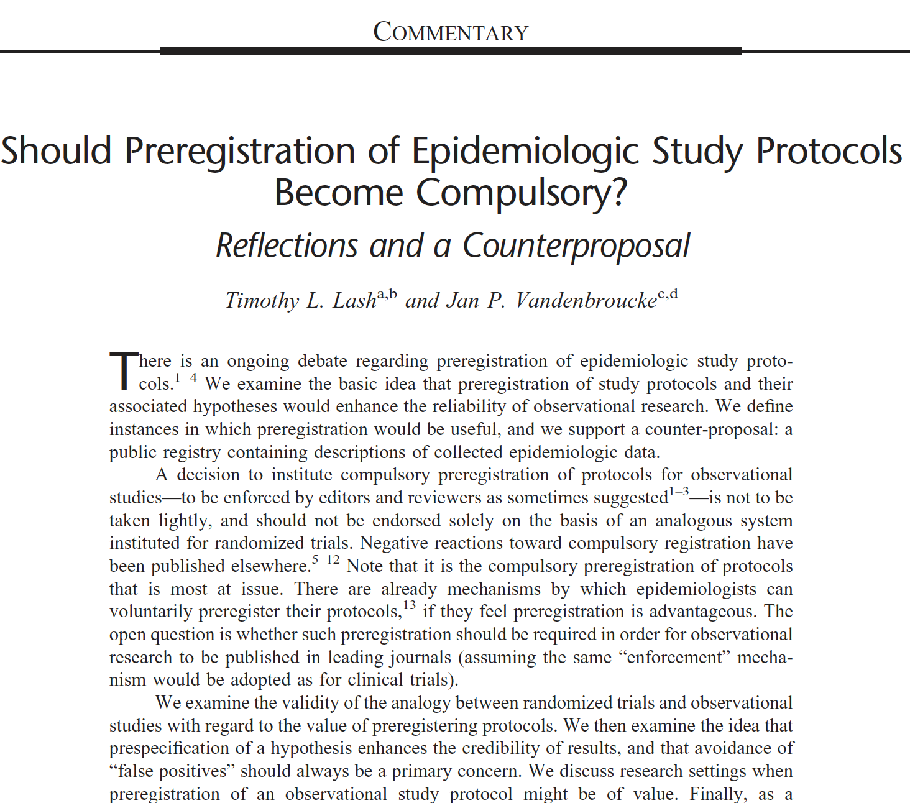
]

.footnote[Lash and Vandenbroucke, *Epidemiology* [(2012)](https://doi.org/10.1097/EDE.0b013e318245c05b)]

---
# Where can you pre-register your study?
.left-column[
```{r, echo=F}
knitr::include_graphics("preregistered_large_color.png")
# ggplot() + geom_fontawesome("fa-pencil-square-o", color='steelblue') + theme_void()
```
]

.right-column[
- The [AEA registry](https://www.socialscienceregistry.org/) includes the option to upload PAPs. Search under
"advanced options" for studies which include PAPs.

- [EGAP](https://egap.org/registry/) is a registry for political science studies, some of which include pre-analysis plans.  

- [3ie](https://www.3ieimpact.org/evidence-hub/ridie) also has a database (RIDIE) of ongoing international development impact evaluations.  

- The Open Science Framework [(OSF)](https://osf.io) also invites pre-registered studies and PAPs.  
- Many clinical trials in the US must be registered with [Clinicaltrials.gov](https://clinicaltrials.gov).
]

---
### Where can you find templates for preregistration?
.footnote[See the [page](https://osf.io/zab38/wiki/home/) at Open Science Foundation]

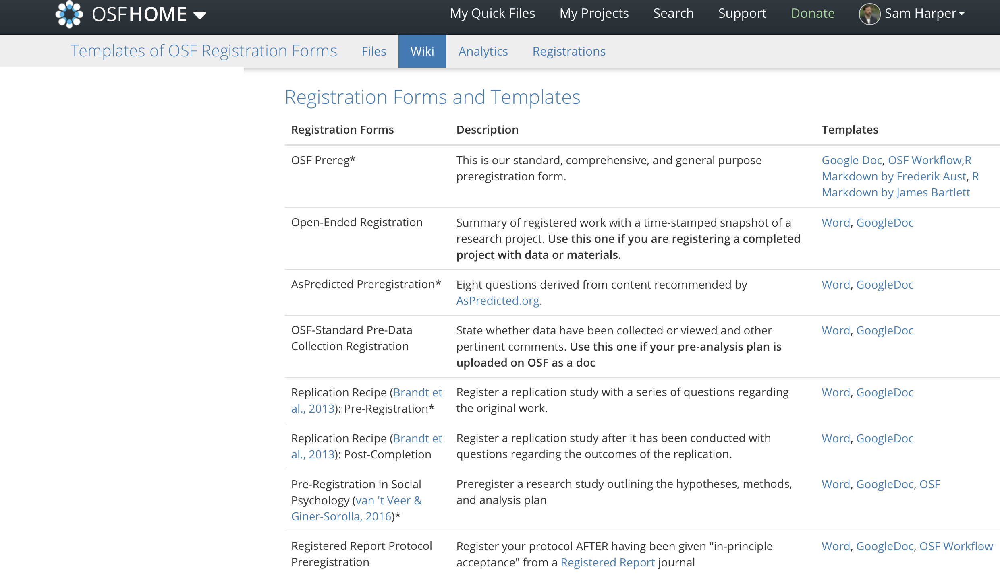

---
# Writing up pre-registered studies

## 1. Include a link to the registration 
## 2. Report *all* pre-registered results.
## 3. Explain and justify deviations.
## 4. Non-registered analyses appropriately described as "exploratory" or "hypothesis generating".

---
# Why does preregistration matter?

## .orange[Evidence synthesis should be on *all* the evidence.]
## .orange[Distorts planning of future studies.]
## .orange[Unethical and wasteful.]

---
class: center, top, inverse
# .background[**X**]
# .orange[**Registration is useful**]

---
.footnote[redrawn from Kaplan and Irwin [(2015)](https://journals.plos.org/plosone/article?id=10.1371/journal.pone.0132382)]

.left-column[
In 2000 NHLBI required the registration of primary outcome on ClinicalTrials.gov for all their grant-funded activity.
]

.right-column[
```{r, echo=F, message=F}
d <- read_csv("kaplan-2015-data.csv",
  col_names=c("Year", "RR", "type"), col_types = "ddf")
p <- ggplot(d, aes(x=Year, y=RR, colour=type)) + geom_vline(xintercept=2000) +  geom_point(size=5) + geom_curve(aes(x = 2006, y = 1.5, xend = 2005, yend = 1.25), curvature=0.2, arrow = arrow(length = unit(0.03, "npc")), colour="grey60") + annotate("text", label = "Increase in\nnull findings.", x = 2006, y = 1.8, size = 9, colour = "gray60", hjust=0) + geom_curve(aes(x = 1999, y = 2, xend = 1999.9, yend = 2), curvature=0, arrow = arrow(length = unit(0.01, "npc")), color="grey20") + annotate("text", label = "Registration\nrequired", x=1999, y=2, size=5, color="grey20", hjust=1) + scale_y_log10(limits=c(0.1,2)) + ylab("RR (log scale)") + scale_color_manual(name="Finding", values=c("grey60", "#6ca0f5", "#d6463a")) + theme_classic() + theme(plot.title = element_text(size = 18, face = "bold"), plot.subtitle = element_text(size=16)) + theme(axis.text.x = element_text(size = 16, colour = "grey20"), axis.title.y=element_text(size=16, angle=90, colour="grey20"), axis.title.x=element_text(size=20, colour="grey20"), axis.text.y = element_text(size = 16, colour="grey20"), legend.position=c(0.9, 0.25), legend.text = element_text(size=14), legend.title = element_text(size=16), panel.grid.major.y = element_line(linetype="dotted", colour="grey60"), panel.grid.major.x = element_line(colour="white"), panel.grid.minor = element_line(colour="white")) + theme(axis.line.x=element_line(colour="grey60"), axis.line.y=element_line(colour="grey60"), axis.ticks = element_blank())
ggsave("kaplan-plos-redraw.png", plot=p, width=11, height=7)
knitr::include_graphics("kaplan-plos-redraw.png")
```
]

---
class: center, top, inverse
# What if my results are null?

# You showed us that they won't get published!

# I have to make rent, you know.

---
## Emphasis on design: .red[Registered Reports]


.footnote[ Lee (2019)]

---
## Emphasis on design: .red[Registered Reports]


.footnote[ Lee (2019)]

---
.footnote[Allen & Mehler, *PLoS Biology* [(2019)](https://journals.plos.org/plosbiology/article?id=10.1371/journal.pbio.3000246)]

.left-column[
### RRs in Psychology

Little difference between 'replication' studies and 'novel' studies.

Big difference from non-registered studies.
]


.right-column[
.center[

]]

---
class: center, top, inverse
# .background[**X**]
# .orange[**Registration is useful**]
# .orange[**but not sufficient**]

---
.footnote[Zarin *NEJM* (2019)]
.center[
A majority of registerd RCTs still not reported.
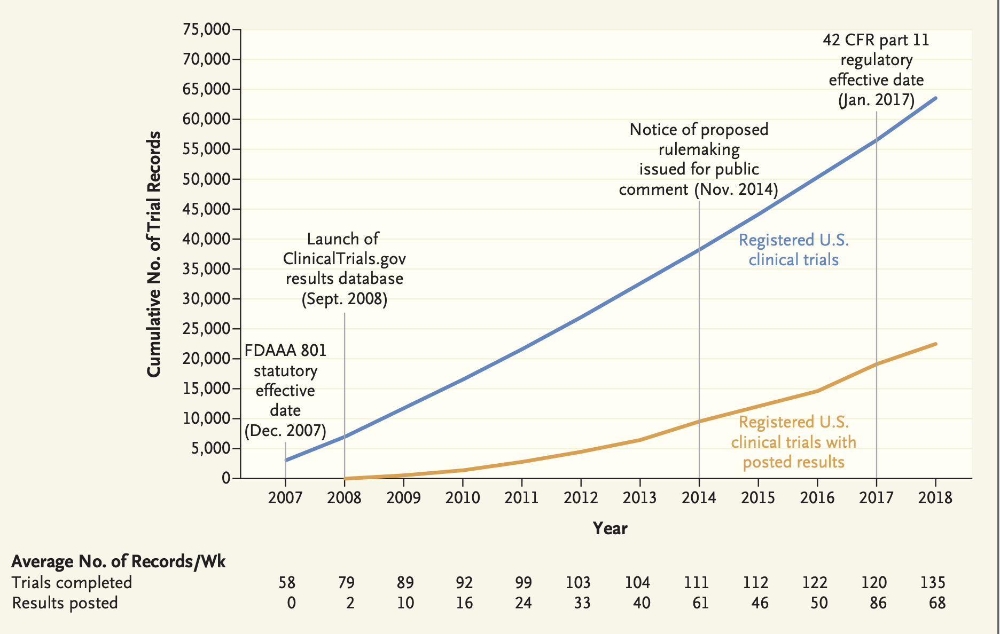
]


---
.footnote[ Goldacre [(2019)](https://trialsjournal.biomedcentral.com/articles/10.1186/s13063-019-3173-2)]

.left-column[
### But is preregistration enough?

- Still many differences between registration and published reports.
]

.right-column[
```{r, echo=F, out.width=700}
knitr::include_graphics("goldacre-compare-title.png")
```
]

---
.footnote[ Goldacre [(2019)](https://trialsjournal.biomedcentral.com/articles/10.1186/s13063-019-3173-2)]

# Academic journals are not helping
.center[
```{r, echo=F, out.width=700}
knitr::include_graphics("goldacre-compare-table.png")
```
]

---
# Preregistration is not a panacea

.right-column[
### Preregistered $\neq$ correct/sensible/useful
#### Transparency helps, but cannot fix terrible design or methods.

### Post-hoc analysis can be worthwhile
#### Probing surprising results or mechanisms generates knowledge.

### May also lead to 'halo' effects
#### Preregistered research deserves equal opportunity interrogation.
]

.footnote[See Nosek et al. [(2019)](https://doi.org/10.1016/j.tics.2019.07.009) and Szollosi et al. [(2020)](https://doi.org/10.1016/j.tics.2019.11.009)]

---
class: center, top, inverse
# .orange[**2. Design Solutions**]

.left[
## .gray[**2.1 Preregistration**]
## .orange[**2.2 Pre-analysis plans**]
## .gray[**2.3 Reporting guidelines**]
]

---
## **H**ypothesizing **A**fter the **R**esults are **K**nown (HARKing)

.left-column[
- Pretending what you found was what you were looking for.

- Easy to "find" theory / biological evidence consistent with results.
]

.right-column[
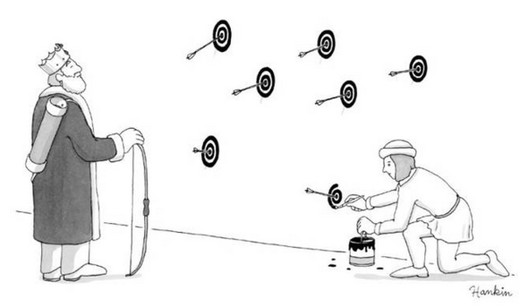
]
.footnote[ *New Yorker*, 2014-12-07]

---
# What is a pre-analysis plan?
.left-column[
```{r, echo=F}

# ggplot() + geom_fontawesome("fa-pencil-square-o", color='steelblue') + theme_void()
```
]

.right-column[
- Detailed description of research design and data analysis plans, submitted to a registry before looking at the data.

- Helps to tie your hands for data analysis (address researcher degrees of freedom, etc.).

- Distinguish between confirmatory and exploratory analysis.

- Increases the credibility of research.

- Transparent methods make it easier for others to build on your work.
]

---
## Confirmatory and exploratory studies have different aims
.footnote[ Dehaven and Bowman OSF (2020)]
.pull-left[
### Confirmatory
- Well-theorized.

- Plausible mechanisms.

- Minimize false positives.

- Hypothesis *testing*.
]

.pull-right[
### Exploratory
- Pushes new ideas.

- Hypothesis *generating*

- Minimize false negatives.

- Testing irrelevant.
]

---
## What goes into a pre-analysis plan?

.pull-left[
- General info (Title, PIs, Staff)

- Introduction and Summary

- Study Design:
  - Hypotheses
  - Main variables
  - Study setting.
  - Intervention components.
  - Data collection methods.
  - Treatment assignment mechanism.
  - Power calculations.
]

.pull-right[
- Analytic decisions
  - models
  - derived variables
  - clustering
  - multiple testing
  
- Threats/mitigation/robustness checks.

- Dissemination plans
]

---
# Example from development economics
.footnote[ Casey et al. [(2012)](https://academic.oup.com/qje/article-abstract/127/4/1755/1841616?redirectedFrom=fulltext)]

.pull-left[

]

--

.pull-right[
### Conclusions:

]

---
## Example from epidemiology
Note the time-stamp, which provides credible evidence of *when* you had your brilliant ideas.

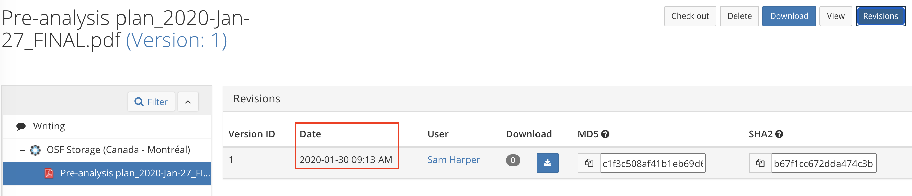


---
.left-column[
### Example from epidemiology
Can be challenging for observational studies or secondary data analyses.

Can you prove when you obtained data access?
]

.right-column[
.center[
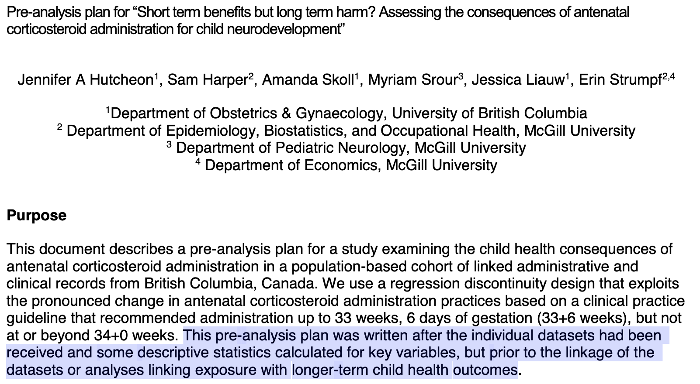
]]

---
class: center, top, inverse
# .orange[**2. Design Solutions**]

.left[
## .gray[**2.1 Preregistration**]
## .gray[**2.2 Pre-analysis plans**]
## .orange[**2.3 Reporting guidelines**]
]

---
.footnote[ Glasziou et al. (2014)]
.pull-left[
# "Most publications have elements that are missing, poorly reported, or ambiguous"
]

.pull-right[

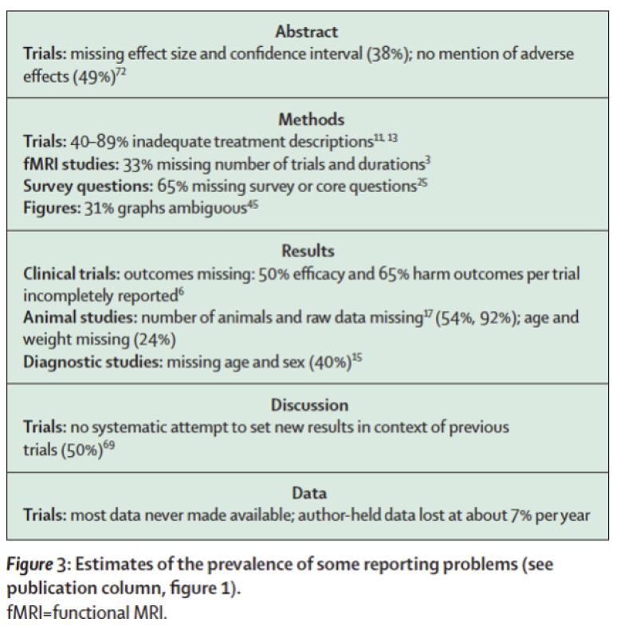
]

---
## Importance of intervention details
.footnote[Hoffman (2013)]
.left-column[
Want decision-makers to act on your evidence?

Can they actually understand what you did?
]

--

.right-column[
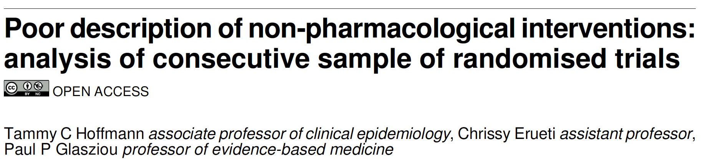
- Of 137 interventions, only 53 (39%) were adequately described;

- The most frequently missing item was the “intervention materials”
(47% complete);

]

---
.footnote[Hoffman (2014)]
.left-column[
Missing due to:
- copyright or intellectual property;

- absent materials or intervention details;

- unaware of their importance.
]

.right-column[
.center[
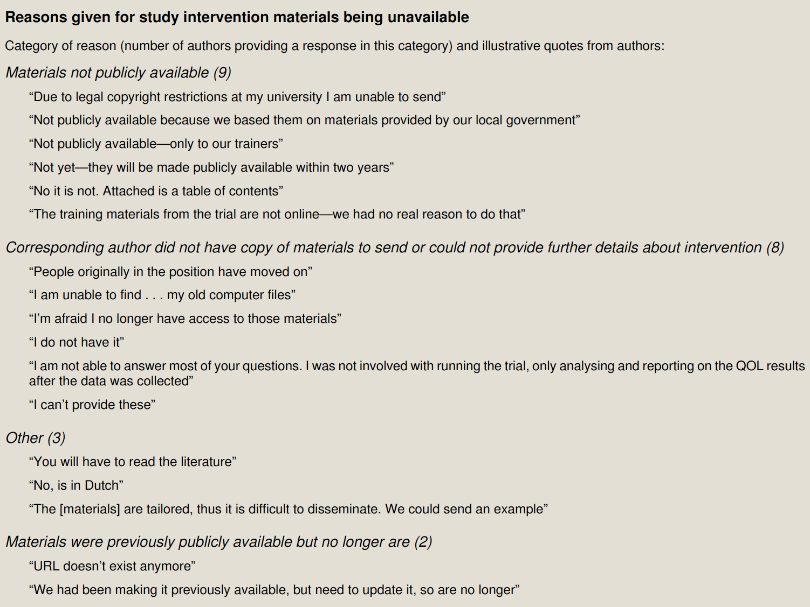
]]

---
Reporting guidelines exist for entire research lifecycle

.footnote[See the [EQUATOR Network](https://www.equator-network.org/)]

.pull-left[
.right[
### Question and approach
#### .white[x]
### Pre-intervention
#### .white[x]
### Research report
#### .white[x]
### Cost-effectivness
]]

--

.pull-right[
.left[
### Systematic review
#### `r emo::ji("point_right")` PRISMA/PROSPERO
### Research protocol/preanalysis
#### `r emo::ji("point_right")` SPIRIT
### Trials/Observational studies
#### `r emo::ji("point_right")` CONSORT/STROBE
### Benefits and costs of interventions
#### `r emo::ji("point_right")` CHEERS
]]

---
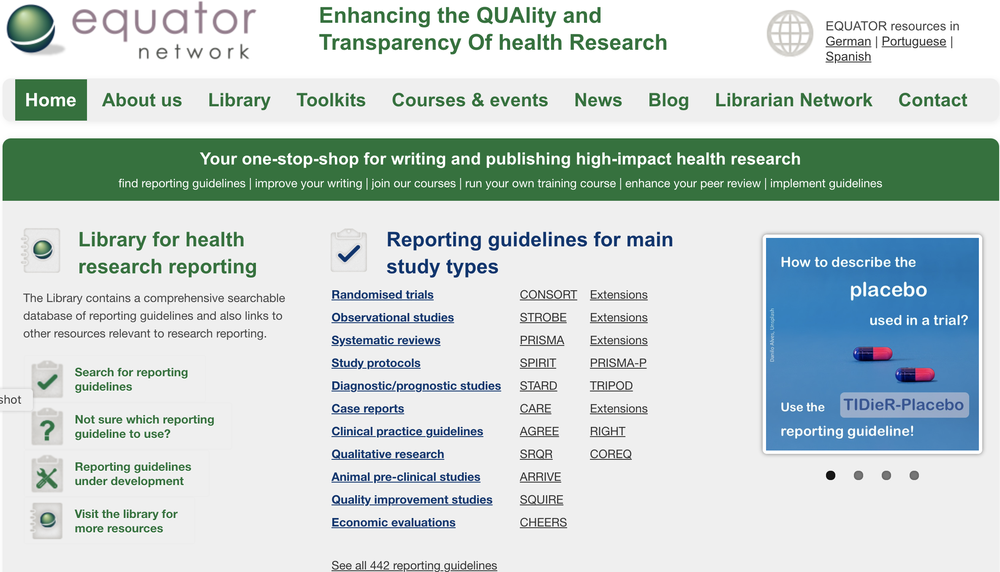

---
## (Some) evidence that it might matter.
.footnote[Hopewell et al. *BMJ* [(2010)](https://www.bmj.com/content/bmj/340/bmj.c723.full.pdf)]

.left-column[
- Some evidence that item reporting has increased.

- Consistent with revised CONSORT (2001).

- Non-adopting journals report fewer items.
]

.right-column[
.center[
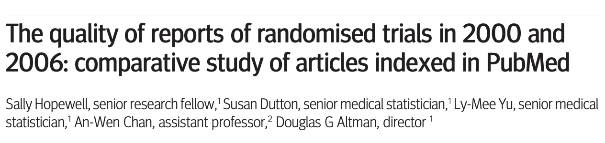
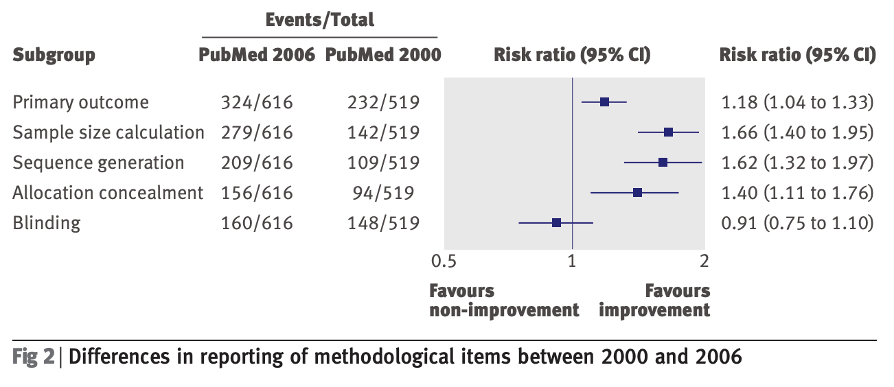
]]

---
Since 2015 funders, journals are embracing *Transparency and Openness* (TOP) guidelines.
.center[
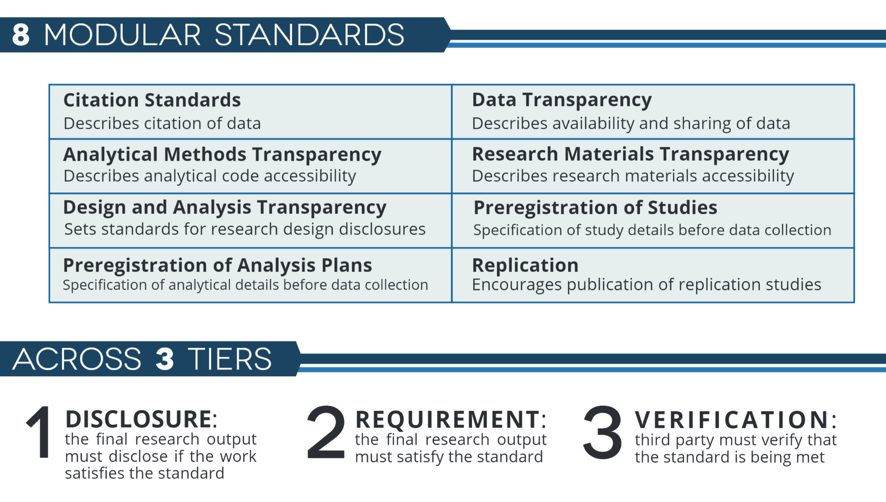
]

.footnote[Source: OSF]

---
## It's still difficult to change norms
.footnote[Hamra, Goldstein, Harper [(2019)](https://www.ahajournals.org/doi/10.1161/JAHA.119.012292)]

.pull-left[
Most journals chose *Level 1* (disclosure)

*J Am Heart Assoc* published 40 original research papers during first half of 2019.
- Posted data: 0
- Posted code: 1
- Data upon "reasonable" request: 30
- Code upon "reasonable" request: 5


]

.pull-right[
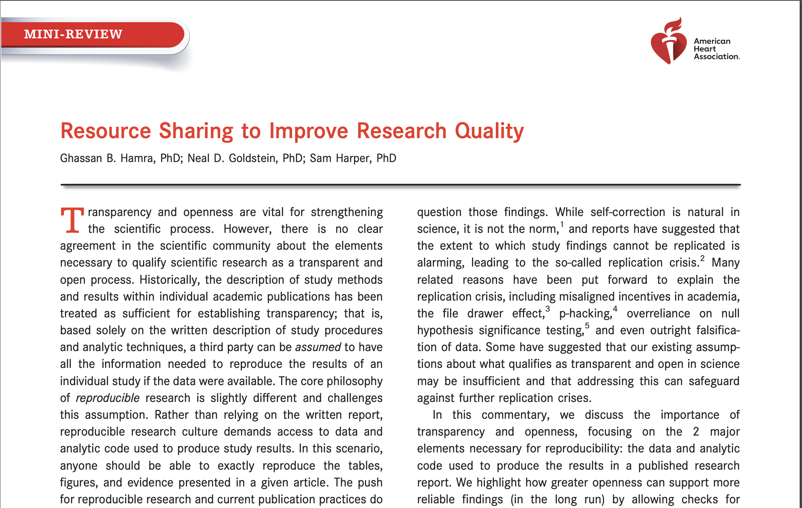
]

---
# Value of reporting guidelines

.left-column[
```{r, echo=F, out.height="100%", out.width="100%"}
ggplot() + geom_fontawesome("fa-check", color='steelblue') + theme_void()
```
]

.right-column[
### Improve transparency of reported research
#### Benefits funders, producers and consumers of research.

### May help to improve the quality of research.
#### More evidence needed, unintented consequences possible.

### Better reporting $\neq$ more reliable.
#### Tranparently reported research can still be biased/bad.
]

---
class: center, middle, inverse
# .orange[**Registration, pre-analysis plans, and reporting guides are design strategies to help mitigate bias from underreported research**]

---
class: center, middle, inverse

## .orange[**They do not guarantee reliable or valid research**]

---
class: center, top, inverse
# .orange[**Break!**] `r emo::ji("coffee")`
```{r, echo=F}
countdown(minutes = 10, 
          left = 0, right = 0, bottom = "15%", top = "15%",
          padding = "50px",
          margin = "5%",
          font_size = "7em",
          color_text= '#f5bc6c')
```