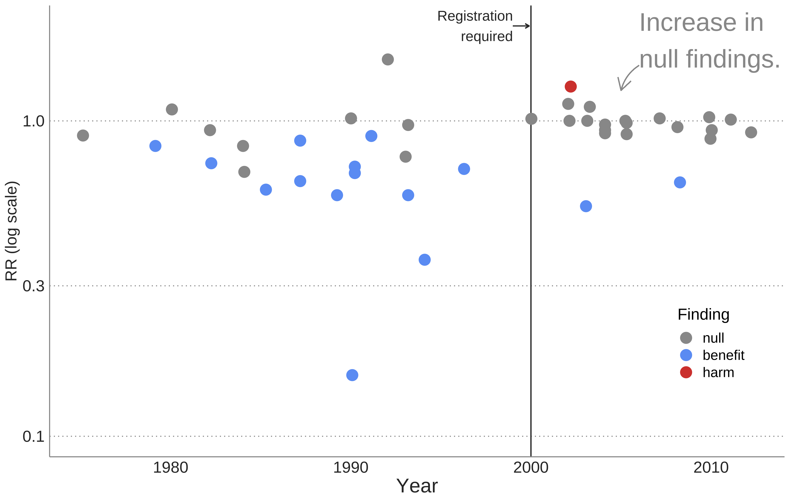
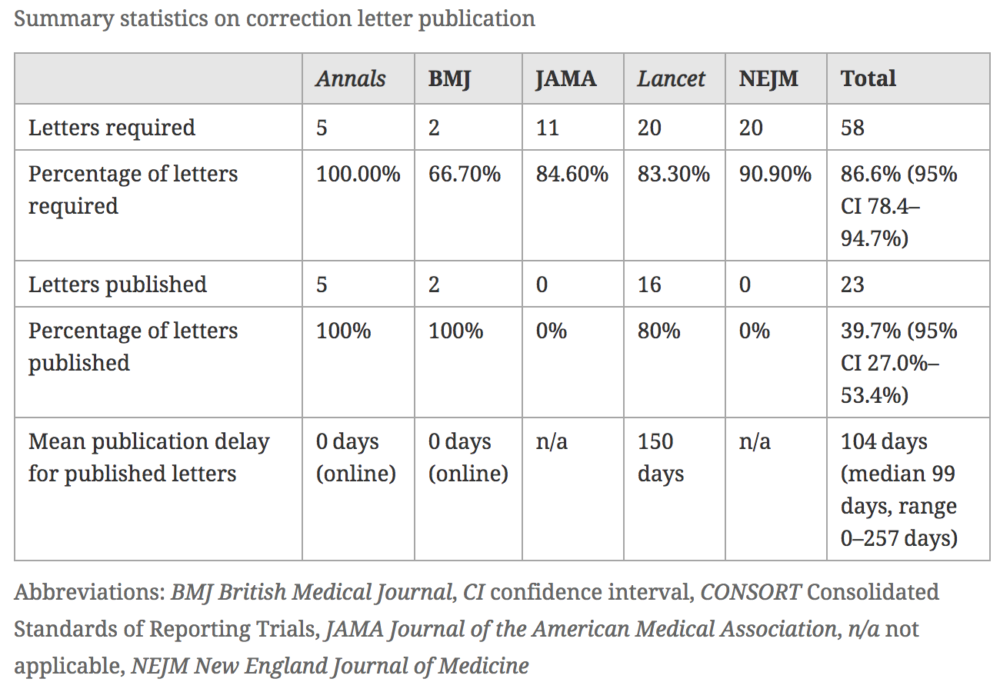

```{r setup, include=FALSE}
options(htmltools.dir.version = FALSE)
library(here)
library(tidyverse)
library(DiagrammeR)
library(xaringan)
library(leaflet)
library(ggplot2)
library(emojifont)
xfun::pkg_load2(c('tikzDevice', 'magick', 'pdftools'))
```

```{r, include=FALSE}
pdf2png = function(path) {
  # only do the conversion for non-LaTeX output
  if (knitr::is_latex_output()) return(path)
  path2 = xfun::with_ext(path, "png")
  img = magick::image_read_pdf(path)
  magick::image_write(img, path2, format = "png")
  path2
}
```

```{r xaringan-themer, include=FALSE}
library(xaringanthemer)
style_xaringan(text_color = "#000000", header_color = "#737373", text_font_size = "24px",  text_font_family = "'Lucida Sans'", header_font_google = google_font("Source Sans Pro"), header_font_weight="lighter", title_slide_background_color =  "#ffffff", title_slide_text_color = "#000000", link_color = "#0000ee", footnote_font_size = "0.5em")
```

class: center, top, inverse
# .orange[**2. Design Solutions**]

--
.left[
## .orange[**2.1 Preregistration**]
## .orange[**2.2 Pre-analysis plans**]
## .orange[**2.3 Reporting guidelines**]
]

---
class: middle, center
# 2.1 Pre-registration

---
# What is study preregistration?
.left-column[
### A detailed research plan that is:
]

.right-column[
### Time stamped
#### Records and publicizes time and date


### Read-only
#### Can't be modified

### Registered prior to data collection
#### Robust to fieldwork
]

---
# What is preregistration?
.left-column[
```{r, echo=F, out.height="100%", out.width="100%"}
knitr::include_graphics("preregistered_large_color.png")
# ggplot() + geom_fontawesome("fa-pencil-square-o", color='steelblue') + theme_void()
```
]

.right-column[
Common / required for publishing most RCTs

Controversial for observational studies.

Idea is to help *reduce publication bias*, since registered studies may be followed over time.

No guarantee anyone will publish.

Also can provide intellectual provenance of your ideas and hypotheses.

Good for planning and hypothesizing, .red[not a straightjacket.]
]

---
# Why preregistration?
1. It's *not* about minimizing Type 1 errors.
- Allowing others to transparently evaluate the credibility of the analysis
- Preventing "file drawer" problems.

---
# Why not preregistration?
- Observational studies are hard.
- Manuscripts may adhere to registrations rather than reality.
- Prespecification is irrelevant to the credibility of inference.
- Severe tests of hypotheses are more important than prespecification.
- 

.footnote[Lash and Vandenbroucke, *Epidemiology* [(2012)](https://doi.org/10.1097/EDE.0b013e318245c05b)]

---
# Where can you pre-register your study?
.left-column[
```{r, echo=F}
knitr::include_graphics("preregistered_large_color.png")
# ggplot() + geom_fontawesome("fa-pencil-square-o", color='steelblue') + theme_void()
```
]

.right-column[
Many different disciplinary “registries”
- AEA
- Clinicaltrials.gov, etc...
]

---
class: center, middle, inverse
# What if my results are null?

--

# Won't it be harder to publish?

---
## Potential solution: .red[Registered Reports]


.footnote[ Lee (2019)]

---
.footnote[redrawn from Kaplan and Irwin [(2015)](https://journals.plos.org/plosone/article?id=10.1371/journal.pone.0132382)]

.left-column[
In 2000 NHLBI required the registration of primary outcome on ClinicalTrials.gov for all their grant-funded activity.
]

.right-column[
```{r, echo=F, message=F}
d <- read_csv("kaplan-2015-data.csv",
  col_names=c("Year", "RR", "type"), col_types = "ddf")
p <- ggplot(d, aes(x=Year, y=RR, colour=type)) + geom_vline(xintercept=2000) +  geom_point(size=5) + geom_curve(aes(x = 2006, y = 1.5, xend = 2005, yend = 1.25), curvature=0.2, arrow = arrow(length = unit(0.03, "npc")), colour="grey60") + annotate("text", label = "Increase in\nnull findings.", x = 2006, y = 1.8, size = 9, colour = "gray60", hjust=0) + geom_curve(aes(x = 1999, y = 2, xend = 1999.9, yend = 2), curvature=0, arrow = arrow(length = unit(0.01, "npc")), color="grey20") + annotate("text", label = "Registration\nrequired", x=1999, y=2, size=5, color="grey20", hjust=1) + scale_y_log10(limits=c(0.1,2)) + ylab("RR (log scale)") + scale_color_manual(name="Finding", values=c("grey60", "#6ca0f5", "#d6463a")) + theme_classic() + theme(plot.title = element_text(size = 18, face = "bold"), plot.subtitle = element_text(size=16)) + theme(axis.text.x = element_text(size = 16, colour = "grey20"), axis.title.y=element_text(size=16, angle=90, colour="grey20"), axis.title.x=element_text(size=20, colour="grey20"), axis.text.y = element_text(size = 16, colour="grey20"), legend.position=c(0.9, 0.25), legend.text = element_text(size=14), legend.title = element_text(size=16), panel.grid.major.y = element_line(linetype="dotted", colour="grey60"), panel.grid.major.x = element_line(colour="white"), panel.grid.minor = element_line(colour="white")) + theme(axis.line.x=element_line(colour="grey60"), axis.line.y=element_line(colour="grey60"), axis.ticks = element_blank())
ggsave("kaplan-plos-redraw.png", plot=p, width=11, height=7)

```
]

---
.footnote[Allen & Mehler, *PLoS Biology* [(2019)](https://journals.plos.org/plosbiology/article?id=10.1371/journal.pbio.3000246)]

.left-column[
### Similar results in Psychology
]


.right-column[
.center[

]
]

---
# Writing up pre-registered studies

## 1. Include a link to the registration 
## 2. Report *all* pre-registered results.
## 3. Explain and justify deviations.
## 4. Non-registered analyses appropriately described as "exploratory" or "hypothesis generating".

---
# Why does preregistration matter?

## .orange[Evidence synthesis should be on *all* the evidence.]
## .orange[Distorts planning of future studies.]
## .orange[Unethical and wasteful.]

---
.footnote[ Goldacre [(2019)](https://trialsjournal.biomedcentral.com/articles/10.1186/s13063-019-3173-2)]

.left-column[
### But is preregistration enough?

- Still many differences between registration and published reports.
]

.right-column[
```{r, echo=F, out.width=700}

```
]

---
.footnote[ Goldacre [(2019)](https://trialsjournal.biomedcentral.com/articles/10.1186/s13063-019-3173-2)]

# Academic journals are not helping
.center[
```{r, echo=F, out.width=700}

```
]

---
# Preregistration is not a panacea

.right-column[
### Preregistered $\neq$ correct/sensible/useful
#### Transparency helps, but cannot fix terrible design or methods.

### Post-hoc analysis can be worthwhile
#### Probing surprising results or mechanisms generates knowledge.

### May also lead to 'halo' effects
#### Preregistered research deserves equal opportunity interrogation.
]


.footnote[See Nosek et al. [(2019)](https://doi.org/10.1016/j.tics.2019.07.009) and Szollosi et al. [(2020)](https://doi.org/10.1016/j.tics.2019.11.009)]
---
class: middle, center
# 2.2 Pre-analysis plans

---
# What is a pre-analysis plan?
.left-column[
```{r, echo=F}
knitr::include_graphics("data_large_color.png")
# ggplot() + geom_fontawesome("fa-pencil-square-o", color='steelblue') + theme_void()
```
]

.right-column[
- Detailed description of research design and data analysis plans, submitted to a registry before looking at the data.

- Helps to tie your hands for data analysis (address researcher degrees of freedom, etc.).

- Distinguish between confirmatory and exploratory analysis.

- Increases the credibility of research.

- Transparent methods make it easier for others to build on your work.
]

---
## What goes into a pre-analysis plan?

.pull-left[
- General info (Title, PIs, Staff)

- Introduction and Summary

- Study Design:
  - Hypotheses
  - Main variables
  - Study setting.
  - Intervention components.
  - Data collection methods.
  - Treatment assignment mechanism.
  - Power calculations.
]

.pull-right[
- Analytic decisions
  - models
  - derived variables
  - clustering
  - multiple testing
  
- Threats/mitigation/robustness checks.
]

---
# Example from development economics
.pull-left[

]

.pull-right[
### Conclusions:

]

.footnote[ Casey et al. (2012)]

---
## Early evidence from psychology

.left-column[
Particularly interesting that >50% of findings for 'novel' studies are consistent with the null.

.footnote[ Allen et al. (2019)]
]

.right-column[

]

---
## Potentially more useful: .red[Registered Reports]


.footnote[ Lee (2019)]

---
class: middle, center
# 2.3 Reporting guidelines

---
# What are reporting standards?
