```{r setup, include=FALSE}
options(htmltools.dir.version = FALSE)
library(here)
library(DiagrammeR)
library(xaringan)
library(leaflet)
library(ggplot2)
library(emojifont)
library(countdown)
library(kableExtra)
xfun::pkg_load2(c('tikzDevice', 'magick', 'pdftools'))
```

```{r, include=FALSE}
pdf2png = function(path) {
  # only do the conversion for non-LaTeX output
  if (knitr::is_latex_output()) return(path)
  path2 = xfun::with_ext(path, "png")
  img = magick::image_read_pdf(path)
  magick::image_write(img, path2, format = "png")
  path2
}
```

```{r xaringan-themer, include=FALSE}
library(xaringanthemer)
style_xaringan(text_color = "#000000", header_color = "#737373", text_font_size = "24px",  text_font_family = "'Lucida Sans'", header_font_google = google_font("Source Sans Pro"), header_font_weight="lighter", title_slide_background_color =  "#ffffff", title_slide_text_color = "#000000", link_color = "#0000ee", footnote_font_size = "0.5em", code_inline_color = '#fa9302', code_inline_background_color = "#f0f0f0")
```


class: center, top, inverse
# .orange[**3. Analytic Solutions**]

--
.left[
## .orange[**3.1 Workflow Management**]
## .orange[**3.2 Documentation**]
## .orange[**3.3 Literate Programming**]
## .orange[**3.4 Version Control**]
## .orange[**3.4 Dynamic Documents**]
]

---
class: center, top, inverse
# .orange[**3. Analytic Solutions**]

.left[
## .orange[**3.1 Workflow Management**]
## .gray[3.2 Documentation]
## .gray[3.3 Literate Programming]
## .gray[3.4 Version Control]
## .gray[3.4 Dynamic Documents]
]

---
# Workflow Advice
.pull-left[
Resources for advice on:
- Planning and organization
- Documentation
- Writing / debugging syntax
- Automating your work
- Variable labeling / naming
- Cleaning
- Archiving
 

Often specific to software but core ideas are the same.
]

.pull-right[
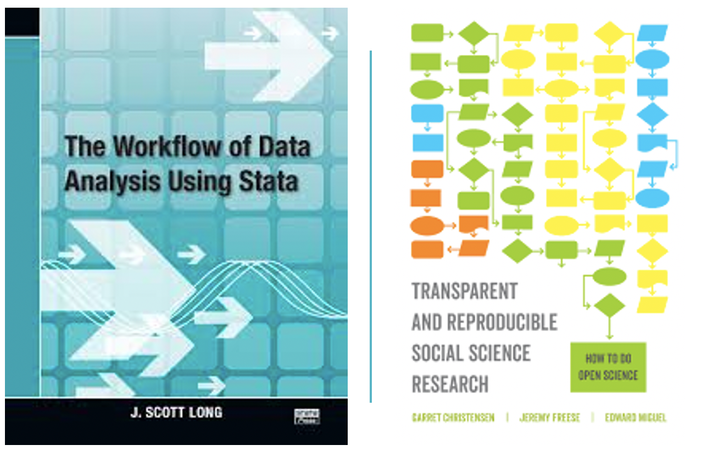
]

.footnote[ Long [(2009)](https://www.stata.com/bookstore/workflow-data-analysis-stata/); Christensen et al. [(2019)](https://www.ucpress.edu/book/9780520296954/transparent-and-reproducible-social-science-research)]
---
# Great online **free** resources for *R*
.footnote[See the series at [bookdown.org](https://bookdown.org/)]

.pull-left[
Technical help for:
- Learning *R*.
- Developing a reproducible workflow.
- Tips & tricks.
- Integration with other software.
- Dealing with frustration.*
]
.pull-right[
.center[
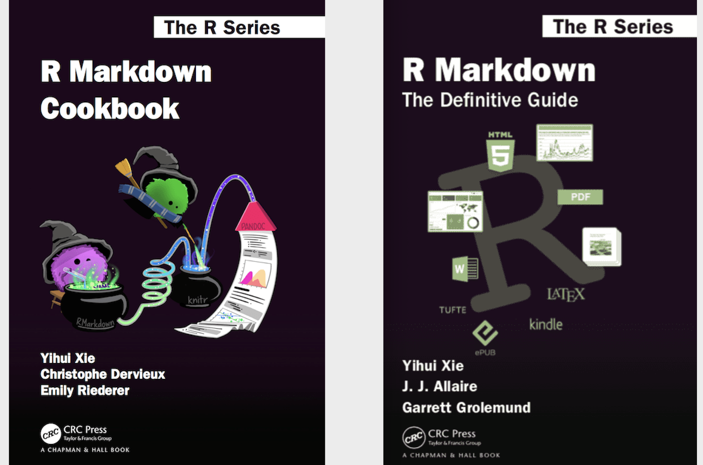]
]

--

*Which is inevitable.

---
# Planning your work
.pull-left[
### Why?

Will save you time.  

Plans should help you stay on track.

Hard, and isn't "fun".
]

.pull-right[
### What:

- Goals and publishing plans
- Scheduling
- Division of labor
- Datasets needed
- Variable names and labels
- Missing data procedures
- Analysis 
- Documentation
- Backing up / archiving
]

---
.footnote[Image credit: [OSF](https://osf.io)]
### Planning for the entire research pipeline
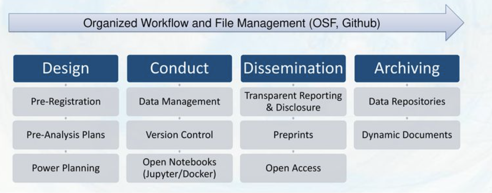

---
# Use projects to keep things organized
.footnote[Jenny Bryan on Project-oriented [workflows](https://www.tidyverse.org/articles/2017/12/workflow-vs-script/). Also possible with [SAS](https://documentation.sas.com/?docsetId=egug&docsetTarget=n1v9z6rladl7jan1tsq9clpzrzo2.htm&docsetVersion=8.2&locale=en).]

.pull-left[
RStudio: .blue[File > New Project...]
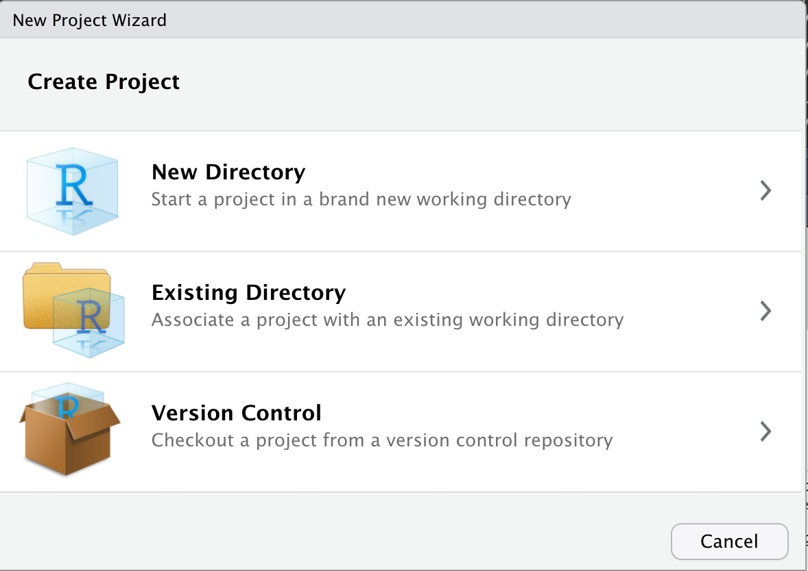
]

.pull-right[
Stata: .blue[File > New > Project...]
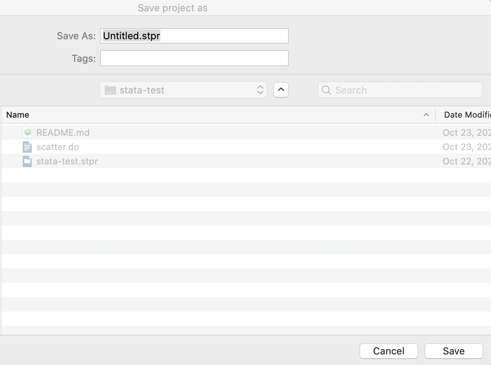
]

---
# Why Projects?
By definition, the directory `/User/samharper/project/data` is not reproducible.  
But `project/data` works anywhere.
--

.right-column[
### Self contained and portable
### Easy to integrate with version control
### Working directory set at project location when opened
### Fresh session when project is launched
]

---
## File organization
.left-column[

]

.right-column[
### Core idea is to separate raw data, analytic data, code, and outputs.

### Why?
- Raw data is **never** altered.
- Separating code from data streamlines re-analysis.
- Outputs (tables, figures) are transient and should be easily regenerated from data + scripts.
]

---
.pull-left[
### Look familar?
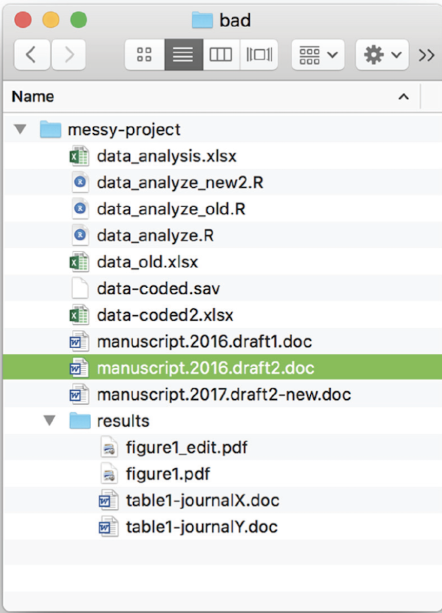
]

--

.pull-right[
### That's more like it.
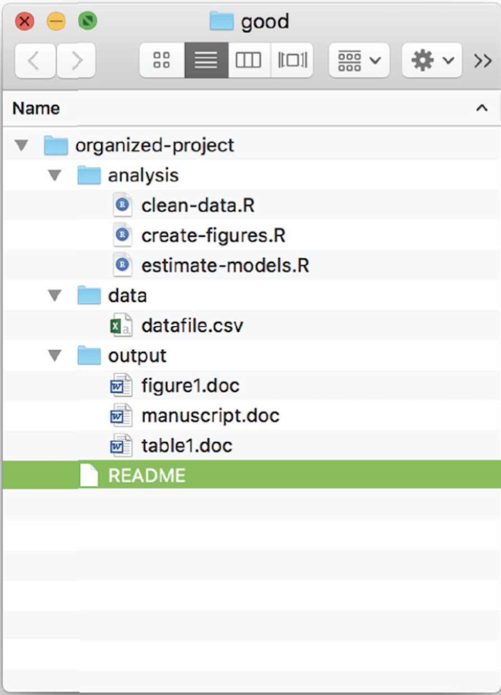
]

---
# Many variations (Project TIER scheme)
.footnote[(https://projecttier.org)]

.left-column[
Also consider including a folder or file for 'metadata'.

Helps computers find your research!
]
.right-column[
.center[
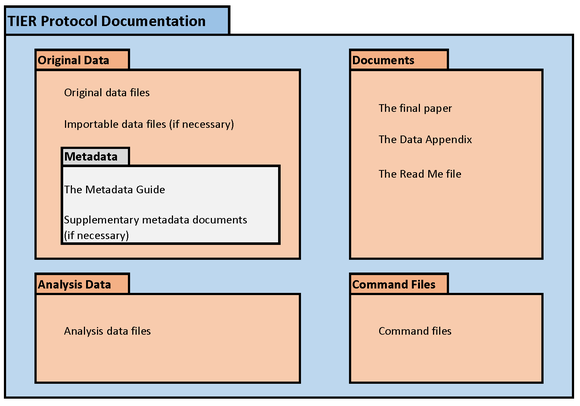
]]

---
class: center, top, inverse

# .background[x]

# .orange[Tip: Don't obsess about rigidly following someone else's workflow.]

--

# .orange[**Important thing is to find a workflow that works for you.**]


---
# Your turn (finally!): Create a project
- Use RStudio or Stata (or something else) to create a new project
- Call it 'myproject'
- Create folders for `data`, `code`, and `output`.

- Now close the program.
- Browse to where the program file exists and double-click.
- Where is the current directory located? (Hint: type `getwd()` into the R console or `pwd` in the Stata command line).

```{r, echo=F}
countdown(minutes = 5)
```

--
- Are you in the right location?
`r emo::ji("white_check_mark")` if yes, `r emo::ji("stop_sign")` if no

---
.left-column[
.footnote[ Example from Long (2009)]
Can also be embedded in the context of a much larger project structure.

Note that "\Source" and "\Derived" data are never in the same folder.
]

.right-column[

]

---
class: center, top, inverse
# .orange[**3. Analytic Solutions**]

.left[
## .gray[3.1 Workflow Management]
## .orange[**3.2 Documentation**]
## .gray[3.3 Literate Programming]
## .gray[3.4 Version Control]
## .gray[3.4 Dynamic Documents]
]

---
class: center, middle

# "It is always faster to document it today than tomorrow."
.right[
# *-J Scott Long*
]
---
.pull-left[
### What should be documented?
- Data sources

- Data decisions
- Statistical analysis

- Software

- Storage
]

.pull-right[
### Levels of documentation
- Research log

- Codebooks

- Dataset documentation
]

---
# Research Log
.left-column[
```{r, echo=F, out.height="100%", out.width="100%"}
ggplot() + geom_fontawesome("fa-edit", color='#f5bc6c') + theme_void()
```
]

.right-column[
The research log should help with:
- Keeping the work on track. Ideas, decision about analysis, papers you read that are relevant...document your thinking!
 
- Dealing with interruptions.
 
- Facilitating replication by others (especially by you 6 months later).
 
Ideally this should document what you did, why you did it, and how you did it.
]

---
### Alexander Graham Bell did it, so can you!
.center[
```{r, echo=F, out.height="80%", out.width="80%"}
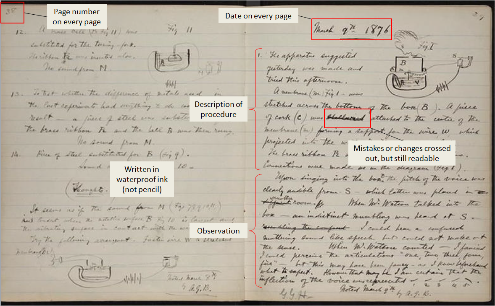
```
]

.footnote[ [Image credit](https://commons.wikimedia.org/wiki/File:Alexander_Graham_Bell%27s_notebook,_March_9,_1876.PNG)]
---
### Example from a (poor) research log
Any format is fine (text, Word, markdown). Requires discipline, but pays dividends later.

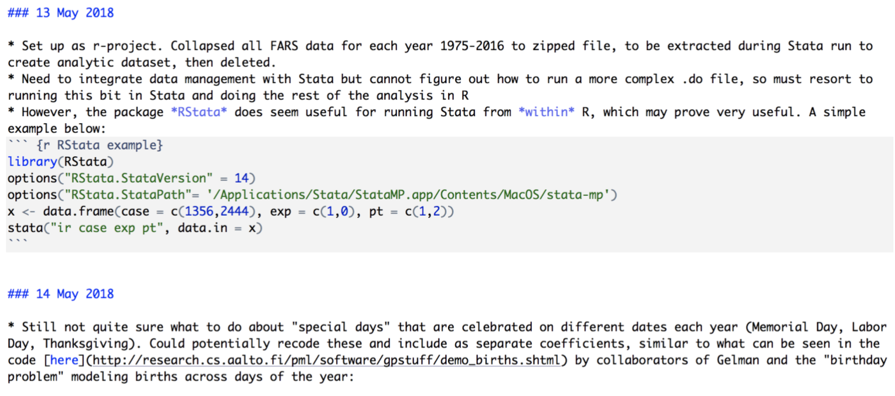

---
## Codebooks
.pull-left[
Codebook is crucial, especially if you are collecting your own data.

Should include:
- Variable name and question number.
- Survey questions.
- Skip patterns.
- Descriptive statistics.
- Missing values and reasons.
- Data imputation.
]

.pull-right[
.center[Good advice `r emo::ji("point_down")` 
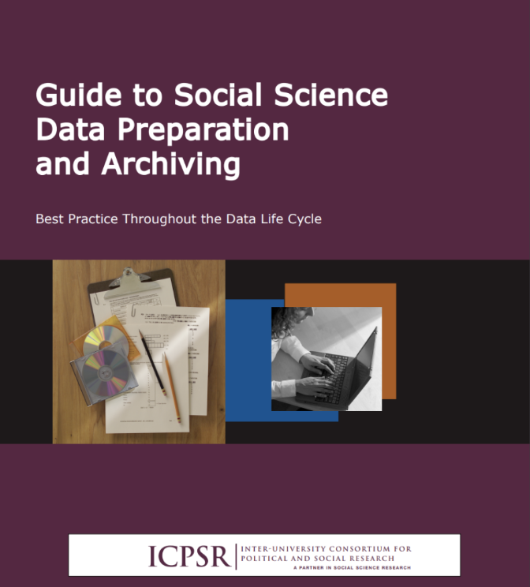]
]

---
# Codebook example (Excel)
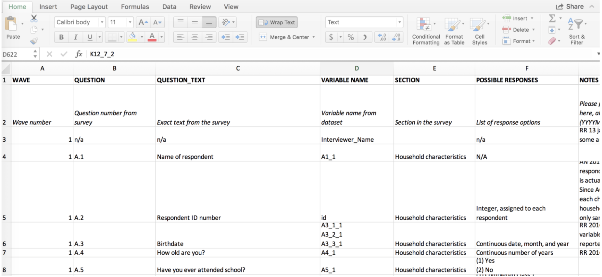

---
### Codebooks can also be automated (using R `r emo::ji("package")` `codebook`)
.left[
Import dataset: `codebook_data <- rio::import("stata.dta")`  
Generate codebook: `codebook(codebook_data)` `r emo::ji("point_down")`
]
.center[
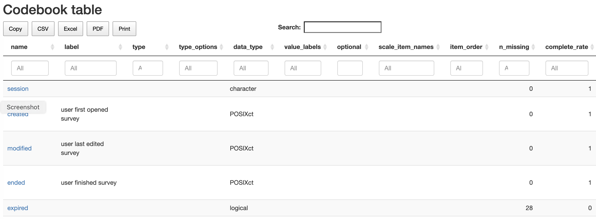
]
---
# Dataset documentation
.pull-left[
### Why?
#### Provides key details about who, what, where, and which processes led to the created datasets.

### How?
#### Ideally, using a reproducible format that can be updated regularly.
]

.pull-right[
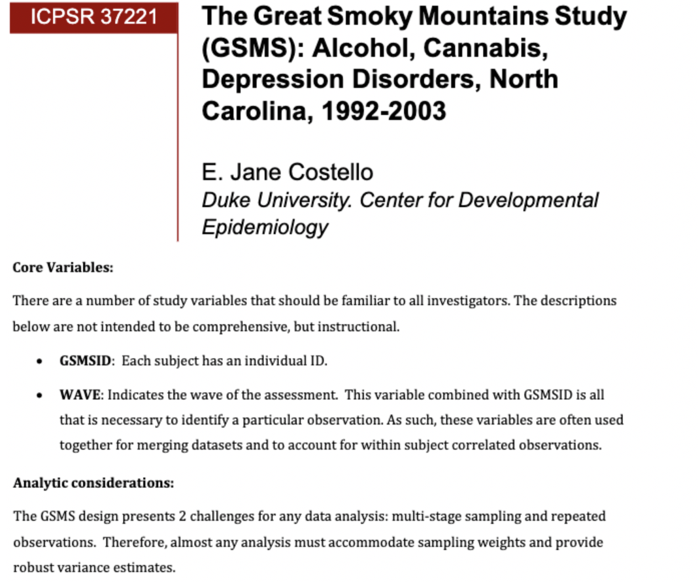
]

---
# One simple way: use a registry
.left-column[
Create a directory containing meta-data on each dataset created for the project.

Links directly to time-stamped source files that create data.
]

.right-column[
.center[
Dataset registry for <project name>  
Created by: NAME1  
Last modified by: NAME2   ]
```{r dataset, echo=F, results='asis'}
tabl <- "
| Dataset        | Filename     | Date  | Source | Comments
|---------------|-------------|------:|-------:|--------:
| 1    | wave1.dta | 2020-09-01 | 01-build-w1.do | Fix missing
| 2     | wave2.dta      |   2020-10-05 | 02-build-w2.do | Ready to merge
| ... |   ...    | ...   | ...  | ...
"
cat(tabl)
```
]
---
class: center, top, inverse
# .orange[**3. Analytic Solutions**]

.left[
## .gray[3.1 Workflow Management]
## .gray[3.2 Documentation]
## .orange[**3.3 Literate Programming**]
## .gray[3.4 Version Control]
## .gray[3.4 Dynamic Documents]
]

---
class:

.left[# "Literate" programming is:]

--

.right-column[
# Code that humans understand.  

# Computers will get it.  
]

---
# Core ideas for coding practices

.right-column[
### Don't modify data by hand
#### This means no Excel for analysis, and no copy/paste.

### Don't point-and-click
#### Typing commands or graphical interfaces are not reproducible.

### Write code scripts
#### Coding creates reproducible workflow.
]

---
### More general coding advice
Comment extensively!

Short lines with no wrapping

Give functions, objects, and variables intuitive names like `edu_percent` rather than `v76`

Label variables and values.

Avoid abbreviations for commands (Stata).

Consider breaking long files into several shorter ones.

---
.left-column[
### Essential parts of a syntax file

This example is for Stata, but the same principles apply to any software.
]
.right-column[
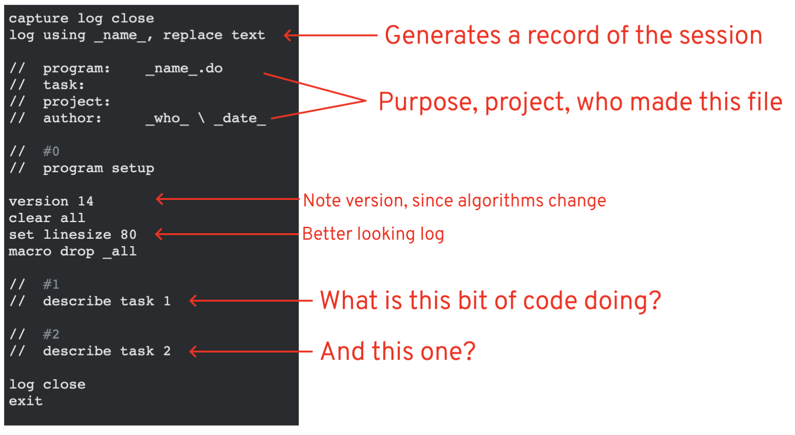
]

---
background-image: url(sas-syntax.png)
background-size: contain
class: right, top

Same idea for SAS
---
### Similar for R, all are adaptable
Consider how you feel when you read someone *else's* code when commenting!
.pull-left[
```r 
# PROJECT
  # Paper:
  # Authors:

# R Script
  # Purpose: 
  # Created: <date> by <author> 
  # Updated: <date> 
  # Inputs: <files required>
  # Outputs: <tables and figures>

######## PACKAGES ########
# Check system for packages
  need <- c("dplyr", "foreign") # list packages needed

```
]

--

.pull-right[
```r
######## ANALYSIS ########
# First fit crude model
fit1 <- lm(...)

# Now add sets of confounders
fit1 <- lm(...)

# Non-linear model for binary outcome
fit3 <- glm(...)

######## ROBUSTNESS ########
# Exposure measured with error (95% Se)
# Quantitative bias analysis using
# parameters from Smith et al. (2014)
fit_corrected <- lm(...)
```
]

---
## Alignment, indentation, automation are your friends...

.pull-left[
### Harder to read
```s
keep sid class_id teacher grade1 ///
grade2 grade3 pass
```
### Without automation
```s
//  create binary variables without loop
generate y_lt2 = y<2 if !missing(y)
generate y_lt3 = y<3 if !missing(y)
generate y_lt4 = y<4 if !missing(y)
```
]

.pull-right[
### Easier to read
```s
keep   sid class_id teacher grade1 ///
       grade2 grade3 pass
```
### With automation
```s
//  create binary variables using a loop
foreach cutpt in 2 3 4 {
    gen y_lt`cutpt' = y<`cutpt' if !missing(y)
  }
```
]

---
## Save outputs as objects to insert into papers
.pull-left[
R:
```{r comment='#', eval=F}
# a boring regression
lm(dist ~ 1 + speed, data = cars)

# save regression results for later
{{fit <- lm(dist ~ 1 + speed, data = cars)}}
```
Note that `fit` contains our results. Now write to a table:
```{r comment='#', eval=F}
library(broom) # need broom pkg
write.csv( tidy( fit ), "t1.csv")
```
Now `t1.csv` has estimates.
]

.pull-right[
Stata:
```{stata, eval=F}
webuse auto, clear

// another boring regression 
regress price mpg
{{estimates store m1}}
```
Here `m1` contains our model results. Write to a table:
```{stata, eval=F}
// need eststo package
esttab m1 using t1.csv
```
Now `t1.csv` has estimates.
]

---
### Can be adapted to other software
.left-column[
Key idea:  
- Results are *static* tables.

- Inserted into compiled manuscript.

- No copy/paste.
]

.right-column[
Example using SAS's **O**utput **D**elivery **S**ystem (ODS):
```sas
data etoh;
set analysis.analysis;
run;

ods select ParameterEstimates;
*ods csv file = "/home/sam.harper/Output/model.csv";
proc logistic data=etoh;
model drunk = free;
run;
ods csv close;
```
.orange[Results written to "model.csv" file]
]

---
# Structure and name files intuitively.
.footnote[See Jenny Bryan's [talk](http://www2.stat.duke.edu/~rcs46/lectures_2015/01-markdown-git/slides/naming-slides/naming-slides.pdf) on naming things.]
.left-column[
```{r, echo=F, out.height="100%", out.width="100%"}
ggplot() + geom_fontawesome("fa-sitemap", color='#f5bc6c') + theme_void()
```
]

.right-column[
Give code, data files, and output logical names where possible.

Number scripts sequentially in the order they should be run, e.g.,: 
- .blue[01_clean_data.R] (or .blue[.do, .sas, etc.])
- .blue[02_main_analysis.R]
- .blue[03_robust_checks.R]

Label output figures with descriptive names, but ones that aren’t likely to change (e.g., .blue[figure_hte.png] is better than .blue[figure_1.png])
]

---
# "One script to rule them all"

.left-column[

]

.right-column[
### Many papers require multiple scripts.
### Dependencies create problems.
### Create a .blue[master-script] to run everything.
### Facilitates '1-click' reproduction.
]

---
### Example of a "master" script (Stata)
This is the content of `code/mvc-laws-master.do`:
```{stata, eval=F}
capture log close master
log using "code/mvc-laws-master", name(master) replace text

//  program:  mvc-laws-master.do
//  task:     run all analyses
//  project:  mandatory seat belt laws and traffic deaths
//  author:   sam harper \ 23feb2017

// Required user-written programs: -tabout, -metan, -estout, -egenmore
// Can be downloaded by typing "ssc install tabout, replace"  and
// "ssc install metan, replace", etc. into the Stata command line


do "code/mvc-laws-data.do"                   // create analytic dataset
do "code/mvc-laws-analysis-descriptives.do"  // descriptive table
do "code/mvc-laws-analysis-models.do"        // model results
do "code/mvc-laws-analysis-appendix.do"      // appendix tables/figures

log close master
exit
```

---
### Your turn #2: Let's create a master script.

1) Open the `myproject` you created in R or Stata and create a new script (File>New File> R Script or File> New > Do-file. Type the following code:
- R: `print("Hello world!")`
- Stata: `disp "Hello world!"`

2) Save it as `1-hello.R` or `1-hello.do` in the "code" folder. 

3) Repeat, creating another new script for `2-goodbye.R`, but type `"Goodbye world!"` instead of `"Hello world!"`
    
Now create a master script called `0-master.R`  or `0-master.do`that will run the two other scripts you created. The command to execute another file is `source` in R and is `do` in Stata. 

4) Run the .blue[master] script. 

- Success? 
`r emo::ji("white_check_mark")` if yes, `r emo::ji("stop_sign")` if no

```{r, echo=F}
countdown(minutes = 7)
```

---
## Something like?
.center[
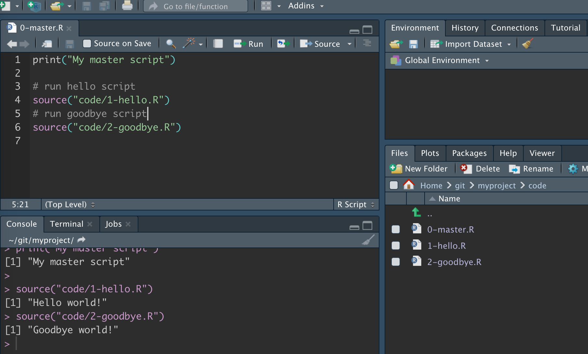
]

---
class: center, top, inverse
# .orange[**3. Analytic Solutions**]

.left[
## .gray[3.1 Workflow Management]
## .gray[3.2 Documentation]
## .gray[3.3 Literate Programming]
## .orange[**3.4 Version Control**]
## .gray[3.4 Dynamic Documents]
]

---
.pull-left[
## Obligatory picture for every discussion of version control.
]
.pull-right[
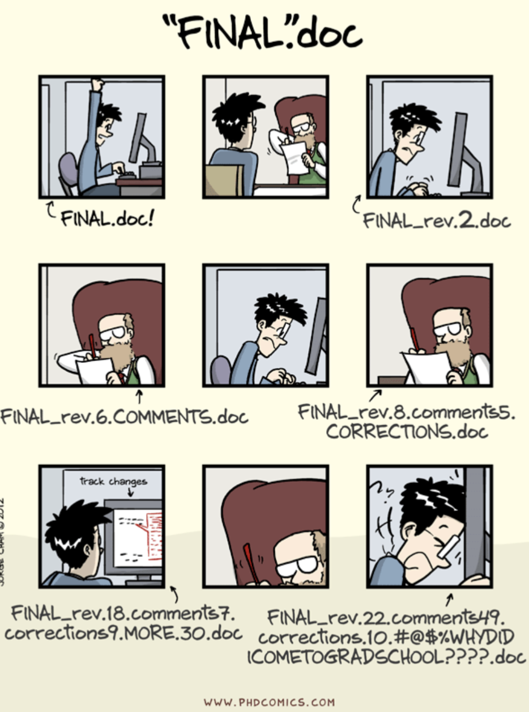
]

---
.left-column[
## But not a joke `r emo::ji("disappointed")`
]

.right-column[
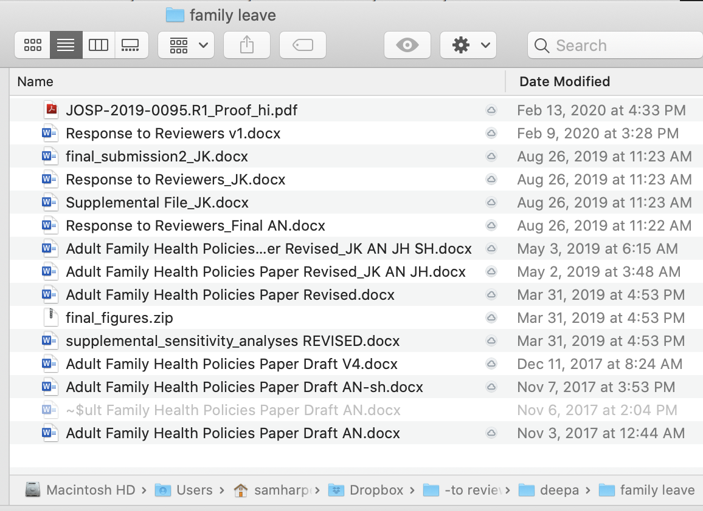
]

---
## One kind of collaborative workflow

.pull-left[
### Collaborator 1:
- cleans data → `data.do`

- analysis → `analysis.do`

- generates Excel tables → `results.xls`

- draft manuscript in Word → `manuscript.docx`
]

.pull-right[
### Collaborator 2:
- adds new variables → `data_new.do`

- new analysis → `analysis2.do`

- new tables → `results_final.xls`

- revises draft with new results → `manuscript-v2.docx`
]

--

.center[
## This can work! But it can also create problems.
]

---
#What is the problem?
Which draft is the current one? Which set of tables contain the "right" results?
.center[
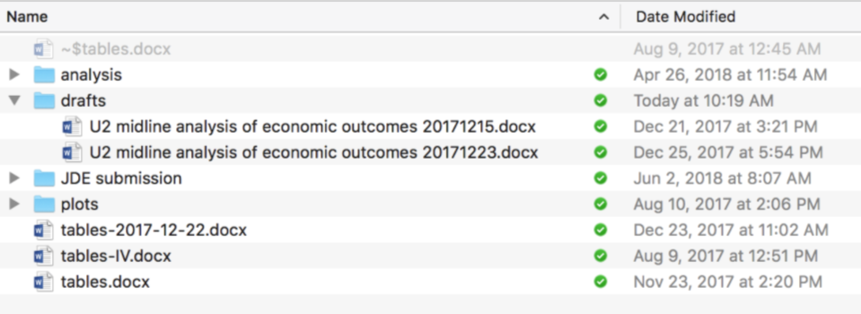
]

---
## A version control system (VCS) automatically keeps track of changes to files and code.
.center[
```{r, echo=F, out.width=600, out.height=400}
knitr::include_graphics("vc-image.png")
```
]

---
## How can version control help?

.pull-left[
Under VCS the prior collaboration would only have 4 files:
- cleans data → .blue[data]

- analysis → .blue[analysis]

- generates results → .blue[results]

- generates manuscript → .blue[manuscript]
]

--

.pull-right[
A VCS keeps track of changes to each file.

We just don't usually see it.

]

---
## How can version control help?
.left-column[
```{r, echo=F}
ggplot() + geom_fontawesome("fa-github", color='steelblue') + theme_void()
```
]

.right-column[
With version control you can:

- Collaborate
- Track each change and **who** made it
- Easily switch between versions of files (i.e. go backward in time)
- Compare versions of files
- Backup
- Work with the same files on different machines
- Collaborators can work simultaneously on the same files on different machines
- Experiment with a new version of code without permanently ruining anything
]

---
## Manual solutions (works, but not ideal)

.left-column[

]

.right-column[
Create dated versions of files (save-as) for each substantive change
 
With each modification, re-run ALL code to make sure nothing is broken—helps if you have a master file to run all scripts!
 
Check-in with coauthors to ensure multiple people aren't working on the same files at the same time.
 
Keep a simple log to remind yourself of the location/content of major changes.
]

---
## Software solutions

.right-column[
Version control software: helps manage versions and edits to files.

Git: Open-source, “distributed model” of version control developed by creator of Linux.

GitHub / GitLab: Free, web-based service that hosts Git “repositories” and offers a variety of features for collaboration:
- Online
- Desktop apps
- Command line (more technical)
]

---
# Advantages of Git

## Provides the entire narrative of your project.

## Allows you to go back in time.

## Experiment without breaking things.

---
How does Git work?
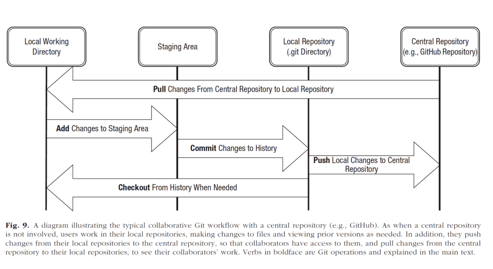

---
### How is that better than Dropbox?
.left-column[
Simultaneous editing in Dropbox leads to "conflicted" copies of files.

Only one person can edit the "live" version of the file.

Can "rollback" to earlier version, but that affects everyone.

]

.right-column[
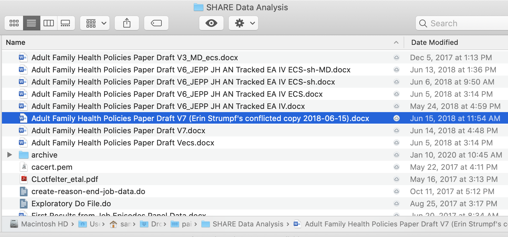
]

---
## Additional resources for Git
- The Basic Workflow of Git (an infographic explaining how Git’s version control system works): https://www.git-tower.com/blog/workflow-of-version-control

- Git + GitHub (information on using Git and GitHub in an R programming context): http://r-pkgs.had.co.nz/git.html

- GitHub’s Git [cheat sheets](https://services.github.com/resources/cheatsheets/) (reference sheets on the most commonly used Git commands)

- [GitHub Glossary](https://help.github.com/articles/github-glossary/) (a glossary of Git and GitHub terminology)

- [Pro Git](https://git-scm.com/book/en/v2) (Chacon & Straub, 2014; a complete manual of Git)

- [tryGit](https://try.github.io) (an interactive Web site for learning the basics of Git)

- Jenny Bryan's [HappyGit](https://happygitwithr.com/)

.footnote[Vuorre & Curley (2018)]

---
class: center, top, inverse
# .orange[**3. Analytic Solutions**]

.left[
## .gray[3.1 Workflow Management]
## .gray[3.2 Documentation]
## .gray[3.3 Literate Programming]
## .gray[3.4 Version Control]
## .orange[**3.4 Dynamic Documents**]
]

---
# What are dynamic documents?
Even with perfect (version controlled) code, you can still run into problems going from your code to paper.  (copy → paste problems)

--

### This is where dynamic documents come in.

A dynamic document includes your data, code, analysis, and output all in one place.

Fully automated so no mistakes from copying and pasting.

Several formats, but most commonly using R Markdown in RStudio or Markdoc in Stata.

---
.footnote[Krieger *PLoS* (2019)]
.center[
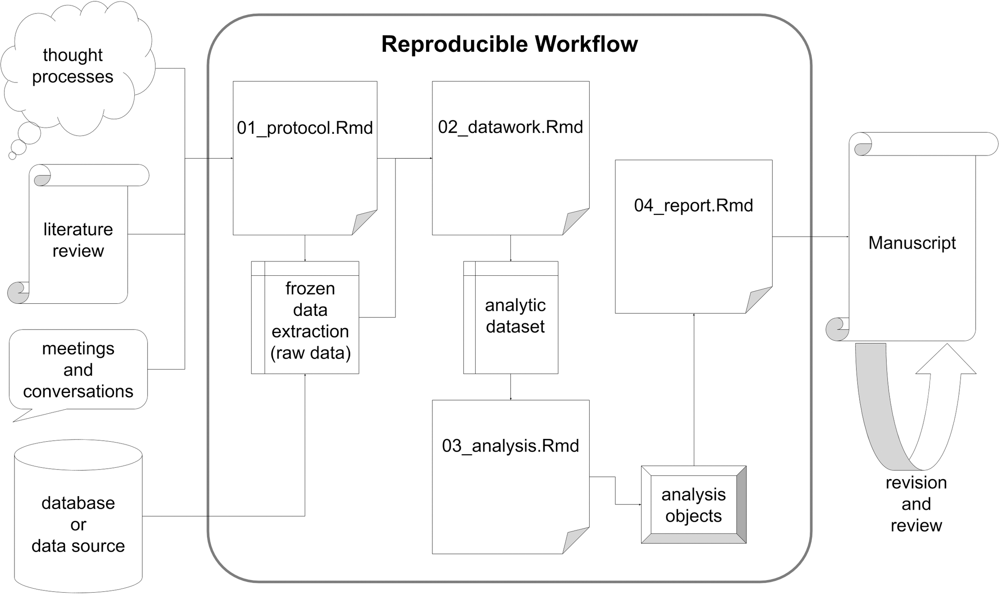
]

---
## How can dynamic documents help?

- Include tables by linking to a file, instead of a static image.
- Reference an estimate (e.g. risk ratio) by linking to a value calculated by an analysis file, instead of a static number typed manually.
- Automatically update tables and numbers if models and/ or data changes.
- Produce entire paper with one or two clicks.
- Most written using markdown language.

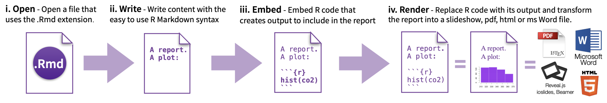

---
background-image: url(markdown-cheat.png)
background-size: contain

---
### Example of a whole paper written and submitted with Rmarkdown 
.pull-left[
.center[`paper.rmd` `r emo::ji("right_arrow")`
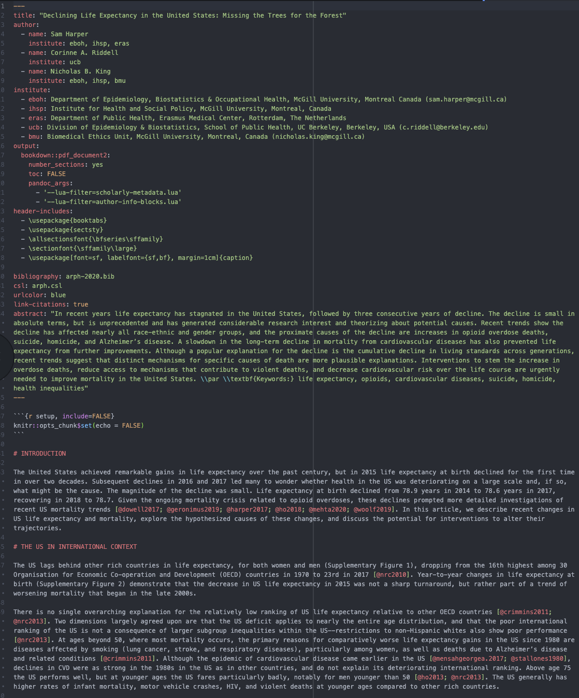]
]

.pull-right[
.center[`r emo::ji("right_arrow")` `paper.pdf`
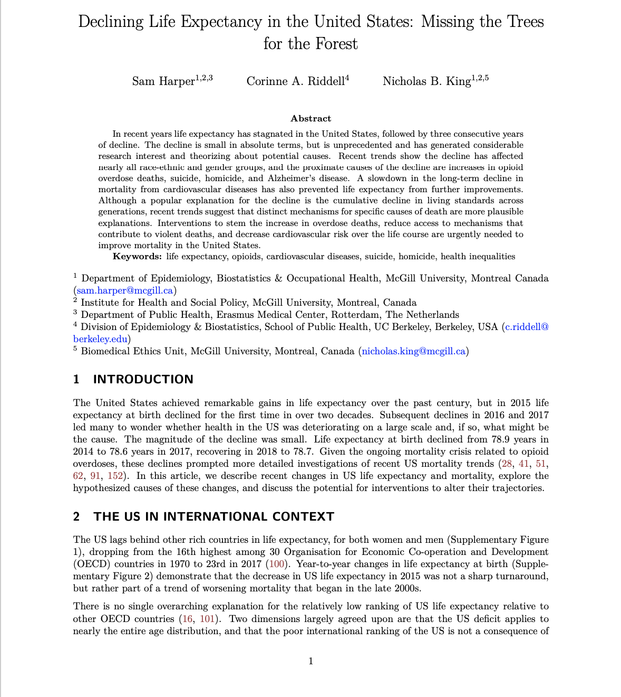]
]

---
.left-column[
### Stata catching up
Since Stata v15, now the `dyndoc` command can produce Word or HTML documents from Markdown. 

More limited functionality than `markstat` but will likely improve.
]

.right-column[
.center[
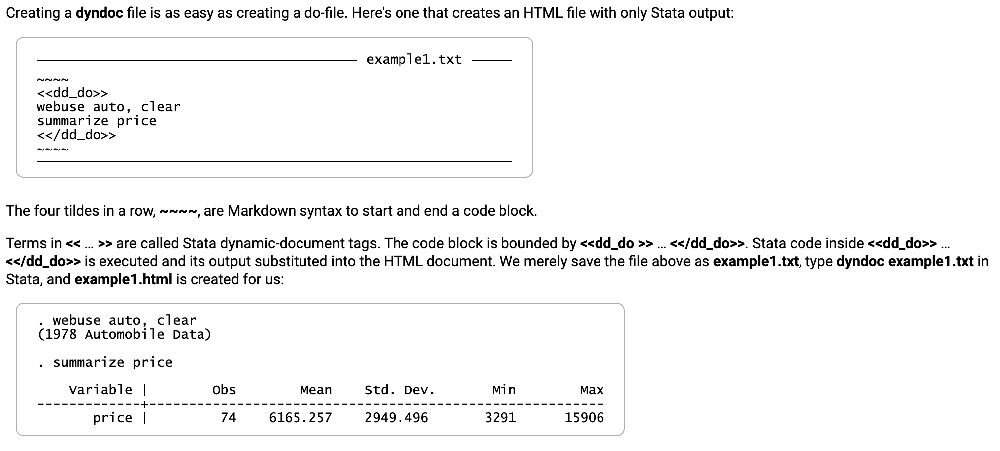
]]

---
# Main elements of a dynamic document
.right-column[
### Header information
#### Document metadata (author, title, date, formatting options).

### Document text
#### Write using markdown language (incl. equations, refs)

### Code: both 'inline' and as 'chunks'
#### Performs data maniupation, analysis, tables, figures.
]

---
## Header (also called YAML*)
.footnote[*YAML stands for YAML Ain't Markup Language. Ha.]
.pull-left[
Rmarkdown:
```yaml
---
title: "My Reproducible Paper"
author: Sam Harper
date: 2020-10-30
{{output: pdf}}
bibliography: myrefs.bib
csl: vancouver.csl
---
```
Other output formats available (e.g., .html or .docx output), many other formatting options.]

--

.pull-right[
Same structure for Stata Markdown:
```yaml
---
title: "My Reproducible Paper"
author: Sam Harper
date: 2020-10-30
abstract: |
  I give a brief summary here.
keywords: |
  markdown, reproducible research.
bibliography: myrefs.bib
---
```
Document format specified in another step.
]

---
## Document text
.pull-left[
Rmarkdown:
```yaml
---
header: 
---
```

Text written using markdown language:
```md
# Introduction
This is why this paper is necessary, and here 
are the gaps it will fill.

# Methods
## Data
We used some cool data.
```
]

--

.pull-right[
Same structure for Stata Markdown:
```yaml
---
header:
---
```
Can add references or equations as well:

```md
## Statistical analysis
We ran a linear regression [@Galton:1875]:

$$
y_{it}=\beta_{0} + \beta_{1}*X 
$$

where $ \beta_{1} $ is what matters.
```
]

---
## Adding inline or 'chunks' of code
.pull-left[
Rmarkdown:
```yaml
---
header: 
---
```
Document text including code 'chunk', set apart by 3 backticks:

```yaml
```r{eval=FALSE}
fit1 <- lm(y ~ x, data=d)
``````
Inline code: single backtick  `` `r
1+1` ``.

]

--

.pull-right[
Structure for Stata Markdown:
```yaml
---
header:
---
```
Same idea for code 'chunks':

```yaml
```s
// Write stata code inside chunks
sum mpg
``````
Inline: single backtick `` `s
r(mean)` ``.
]

---
### Allow text to update automatically when results change.
.pull-left[
Rmarkdown:

Header + document text followed by code chunk:

```yaml
```r{eval=FALSE}
fit1 <- lm(y ~ x, data=d)
est <- summary(fit1)$coefficients["x","Estimate"]
``````
We find x increases y by  `` `r
est` ``.

.blue[Will update if data or estimates change.]

]

--

.pull-right[
Structure for Stata Markdown:

Header + text with Stata code chunks:

```yaml
```s
reg price mpg
``````
Mpg increases price by `` `s
_b[mpg]` `` with a standard error of `` `s
_se[mpg]` ``.

.blue[These are dynamic values.]
]

---
### Stata markdown example (start at project directory)
.pull-left[
Stata do-file (`code/paper.do`) calls the markdown file using the `markstat` command:
```s
// change to writing directory
cd writing


// generate the manuscript
markstat using "paper.stmd", pdf

// back to the main directory
cd ..
```
]

.pull-right[
Markdown text (`writing/paper.stmd`)
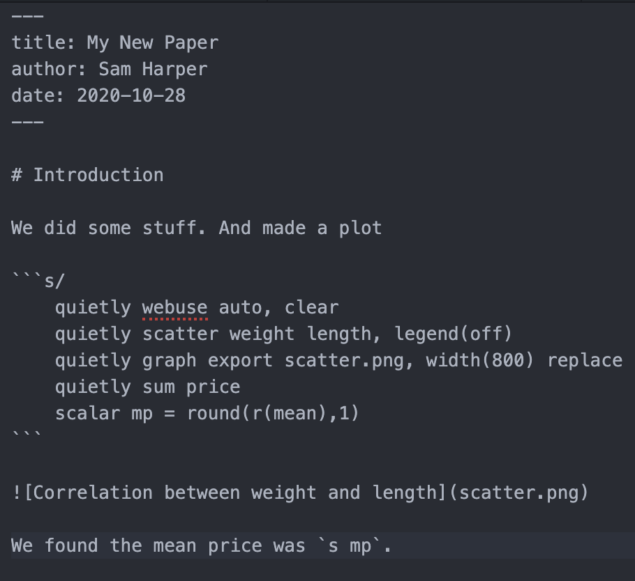
]

---
background-image: url(markstat-paper.png)
background-size: contain

---
background-image: url(sas-rmd-workflow.png)
background-size: contain
class: center, right
### Can be adapted to other software

---

.left-column[
### Rmarkdown + results from SAS

1. Use SAS to fit models, generate results.

2. Export results to static tables.

3. 'Knit' together with text using Rmarkdown.
]

.right-column[
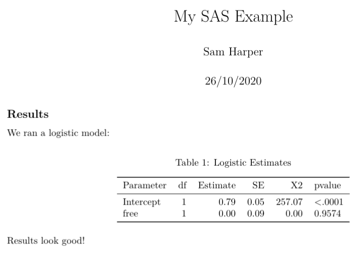
]

---
class: center, top, inverse
# .orange[**Break!**] `r emo::ji("coffee")`
```{r, echo=F}
countdown(minutes = 10, 
          left = 0, right = 0, bottom = "15%", top = "15%",
          padding = "50px",
          margin = "5%",
          font_size = "7em",
          color_text= '#f5bc6c')
```