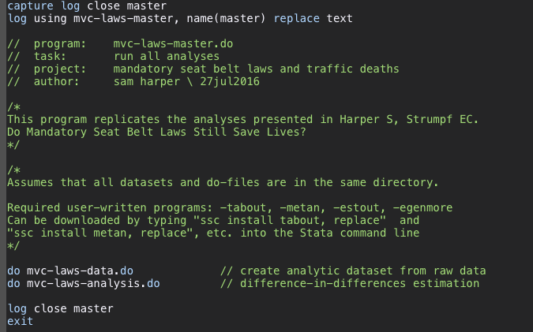
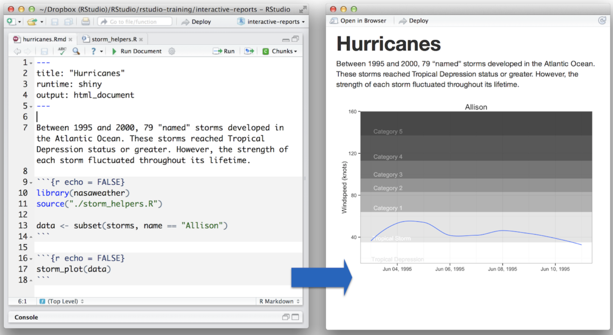

```{r setup, include=FALSE}
options(htmltools.dir.version = FALSE)
library(here)
library(DiagrammeR)
library(xaringan)
library(leaflet)
library(ggplot2)
library(emojifont)
library(countdown)
xfun::pkg_load2(c('tikzDevice', 'magick', 'pdftools'))
```

```{r, include=FALSE}
pdf2png = function(path) {
  # only do the conversion for non-LaTeX output
  if (knitr::is_latex_output()) return(path)
  path2 = xfun::with_ext(path, "png")
  img = magick::image_read_pdf(path)
  magick::image_write(img, path2, format = "png")
  path2
}
```

```{r xaringan-themer, include=FALSE}
library(xaringanthemer)
style_xaringan(text_color = "#000000", header_color = "#737373", text_font_size = "24px",  text_font_family = "'Lucida Sans'", header_font_google = google_font("Source Sans Pro"), header_font_weight="lighter", title_slide_background_color =  "#ffffff", title_slide_text_color = "#000000", link_color = "#0000ee", footnote_font_size = "0.5em")
```


class: center, top, inverse
# .orange[**3. Analytic Solutions**]

--
.left[
## .orange[**3.1 Workflow Management**]
## .orange[**3.2 Documentation**]
## .orange[**3.3 Literate Programming**]
## .orange[**3.4 Version Control**]
## .orange[**3.4 Dynamic Documents**]
]

---
class: center, top, inverse
# .orange[**3. Analytic Solutions**]

--
.left[
## .orange[**3.1 Workflow Management**]
## .gray[3.2 Documentation]
## .gray[3.3 Literate Programming]
## .gray[3.4 Version Control]
## .gray[3.4 Dynamic Documents]
]
---

class: center, middle
# 3.1 Workflow Management

`r countdown(minutes = 2)`

---
# Workflow Advice
.pull-left[
Resources for advice on:
- Planning and organization
- Documentation
- Writing / debugging syntax
- Automating your work
- Variable labeling / naming
- Cleaning
- Archiving
 

Often specific to software but core ideas are the same.
]

.pull-right[

]

.footnote[ Long [(2009)](https://www.stata.com/bookstore/workflow-data-analysis-stata/); Christensen et al. [(2019)](https://www.ucpress.edu/book/9780520296954/transparent-and-reproducible-social-science-research)]
---
# Planning your work
.pull-left[
### Why?

Will save you time.  

Plans should help you stay on track.

Hard, and isn't "fun".
]

.pull-right[
### What:

- Goals and publishing plans
- Scheduling
- Division of labor
- Datasets needed
- Variable names and labels
- Missing data procedures
- Analysis 
- Documentation
- Backing up / archiving
]

---
## File organization
.left-column[

]

.right-column[
### Core idea is to separate raw data, analytic data, code, and outputs.

### Why?
- Raw data is **never** altered.
- Separating code from data streamlines re-analysis.
- 
]

---
.pull-left[
### Look familar?

]

--

.pull-right[
### That's more like it.

]

---
# Use projects to keep things organized

---
```
+-- _config.yml  
+-- _drafts  
|   +-- begin-with-the-crazy-ideas.textile  
|   +-- on-simplicity-in-technology.markdown 
```

---
.pull-left[
An example using `{{}}`:

    `r ''````{r tidy=FALSE}
    if (TRUE) {
    *{{ message("Very important!") }}
    }
    ```
]

--

.pull-right[
Stata example
```{stata, eval=F}
    sysuse auto, clear
   ```{/s}
        describe
   ```
```

]

---
.left-column[
.footnote[ Example from Long (2009)]
Can also be embedded in the context of a much larger project structure.

Note that "\Source" and "\Derived" data are never in the same folder.
]

.right-column[

]

---
class: center, top, inverse
# .orange[**3. Analytic Solutions**]

.left[
## .gray[3.1 Workflow Management]
## .orange[**3.2 Documentation**]
## .gray[3.3 Literate Programming]
## .gray[3.4 Version Control]
## .gray[3.4 Dynamic Documents]
]

---
class: center, middle
# Documentation

---
.pull-left[
### What should be documented?
- Data sources

- Data decisions
- Statistical analysis

- Software

- Storage
]

.pull-right[
### Levels of documentation
- Research log

- Codebooks

- Dataset documentation
]

---
# Research Log
.left-column[
```{r, echo=F, out.height="100%", out.width="100%"}
ggplot() + geom_fontawesome("fa-edit", color='#f5bc6c') + theme_void()
```
]

.right-column[
The research log should help with:
- Keeping the work on track. Ideas, decision about analysis, papers you read that are relevant...document your thinking!
 
- Dealing with interruptions.
 
- Facilitating replication by others (especially by you 6 months later).
 
Ideally this should document what you did, why you did it, and how you did it.
]

---
### Alexander Graham Bell did it, so can you!
.center[
```{r, echo=F, out.height="80%", out.width="80%"}
knitr::include_graphics("bell-notebook-1876-03-09.png")
```
]

.footnote[ [Image credit](https://commons.wikimedia.org/wiki/File:Alexander_Graham_Bell%27s_notebook,_March_9,_1876.PNG)]
---
### Example from a (poor) research log
Any format is fine (text, Word, markdown). Requires discipline, but pays dividends later.


---
## Codebooks
.pull-left[
Codebook is crucial, especially if you are collecting your own data.

Should include:
- Variable name and question number.
- Survey questions.
- Skip patterns.
- Descriptive statistics.
- Missing values and reasons.
- Data imputation.
]

.pull-right[
.center[Good advice `r emo::ji("point_down")` 
]
]
---
class: center, top, inverse
# .orange[**3. Analytic Solutions**]

.left[
## .gray[3.1 Workflow Management]
## .gray[3.2 Documentation]
## .orange[**3.3 Literate Programming**]
## .gray[3.4 Version Control]
## .gray[3.4 Dynamic Documents]
]

---
class: center, middle

# Literate Programming

---
# What is 'literate programming'?

### Programming is key to reproducibility.  
#### Working in Excel is not reproducible.

### "Literate" means writing code that is understandable to humans.   
#### Computers will get it.  

---
# Structure and name files intuitively.
.left-column[
```{r, echo=F, out.height="100%", out.width="100%"}
ggplot() + geom_fontawesome("fa-sitemap", color='#f5bc6c') + theme_void()
```
]

.right-column[Create separate scripts for merging/cleaning and data analysis, with a .blue[*master-script*] for running it all

Give code, data files, and output logical names where possible.

Number scripts sequentially in the order they should be run, e.g.,: 
- .blue[01_clean_data.R]
- .blue[02_main_analysis.R]
- .blue[03_robust_checks.R]

Label output figures with descriptive names, but ones that aren’t likely to change (e.g., .blue[figure_hte.png] is better than .blue[figure_1.png])
]
---
### Example of a "master" script (Stata)
```{stata, eval=F}
capture log close master
log using "code/mvc-laws-master", name(master) replace text

//  program:  mvc-laws-master.do
//  task:     run all analyses
//  project:  mandatory seat belt laws and traffic deaths
//  author:   sam harper \ 23feb2017

// Required user-written programs: -tabout, -metan, -estout, -egenmore
// Can be downloaded by typing "ssc install tabout, replace"  and
// "ssc install metan, replace", etc. into the Stata command line


do "code/mvc-laws-data.do"                   // create analytic dataset
do "code/mvc-laws-analysis-descriptives.do"  // descriptive table
do "code/mvc-laws-analysis-models.do"        // model results
do "code/mvc-laws-analysis-appendix.do"      // appendix tables/figures

log close master
exit
```

---
### Example of a "master" script (Stata)
.center[

]

---
### Writing "robust" code/scripts
- Comment extensively
- Use self-contained syntax  
- Version control
- Exclude directory information - use relative paths:
 

NO: 
```{r, eval=F}
use '/Users/samharper/Dropbox/-today/replication/workshop/project/data-clean.dta'
```
 
YES:
```{r, eval=F}
use 'data-clean.dta'
```
 
- Include seeds for random numbers
- Archive user written programs / .ado files
- Automate as much as you can to avoid mistakes and repetition.


---
.left-column[
### Essential parts of a syntax file

This example is for Stata, but the same principles apply to any software.
]
.right-column[

]

---
background-image: url(sas-syntax.png)
background-size: contain
class: right, top

Same idea for SAS
---
### Similar for R, all are adaptable
```r 
# PROJECT
  # Paper:
  # Authors:

# R Script
  # Purpose: 
  # Created: <date> by <author> 
  # Updated: <date> 
  # Inputs: <files required>
  # Outputs: <tables and figures>

######## PACKAGES ########
# Check system for packages
  need <- c("dplyr", "foreign") # list packages needed
  ...etc...

######## ANALYSIS ########
fit <- lm(...)
```

---
class: center, top, inverse
# .orange[**3. Analytic Solutions**]

.left[
## .gray[3.1 Workflow Management]
## .gray[3.2 Documentation]
## .gray[3.3 Literate Programming]
## .orange[**3.4 Version Control**]
## .gray[3.4 Dynamic Documents]
]


---
class: center, middle

# Version Control

---
class: middle
.pull-left[
Obligatory picture:

]
--
.pull-right[
But not a joke (sigh):

]

---
## One kind of collaborative workflow

.pull-left[
### Collaborator 1:
- cleans data → .blue[`data.do`]

- analysis → `analysis.do`

- generates Excel tables → `results.xls`

- draft manuscript in Word → `manuscript.docx`
]

.pull-right[
### Collaborator 2:
- adds new variables → `data_new.do`

- new analysis → `analysis2.do`

- new Excel tables → `results_final.xls`

- revises draft with new results → `manuscript-v2.docx`
]

---
#What is the problem?
Which draft is the current one? Which set of tables contain the "right" results?
.center[

]

---
## A version control system (VCS) automatically keeps track of changes to files and code.
.center[
```{r, echo=F, out.width=600, out.height=400}
knitr::include_graphics("vc-image.png")
```
]

---
## How can version control help?

.pull-left[
Under VCS the prior collaboration would only have 4 files:
- cleans data → .blue[data]

- analysis → .blue[analysis]

- generates results → .blue[results]

- generates manuscript → .blue[manuscript]
]

--

.pull-right[
Notice the lack of file extensions.

This is because all files are based on source code

We just don't usually see it.
]

---
## How can version control help?
With version control you can:

- Collaborate
- Track each change and **who** made it
- Easily switch between versions of files (i.e. go backward in time)
- Compare versions of files
- Backup
- Work with the same files on different machines
- Collaborators can work simultaneously on the same files on different machines
- Experiment with a new version of code without permanently ruining anything

---
## Manual solutions (works, but not ideal)

Create dated versions of files (save-as) for each substantive change
 
With each modification, re-run ALL code to make sure nothing is broken—helps if you have a master file to run all scripts!
 
Check-in with coauthors to ensure multiple people aren’t working on the same files at the same time.
 
Keep a simple log to remind yourself of the location/content of major changes.

---
## Software solutions
Version control software: helps manage versions and edits to files (e.g., Microsoft Word’s “track changes”, or Google Doc’s “suggestion” feature)—many options.

Git: Open-source, “distributed model” of version control developed by creator of Linux.

GitHub / GitLab: Free, web-based service that hosts Git “repositories” and offers a variety of features for collaboration:
- Online
- Desktop apps
- Command line (more technical)

---
How does Git work?


---
### How is that better than Dropbox?
.left-column[
Simultaneous editing in Dropbox leads to "conflicted" copies of files.

Only one person can edit the "live" version of the file.

Can "rollback" to earlier version, but that affects everyone.

]

.right-column[

]

---
class: center, top, inverse
# .orange[**3. Analytic Solutions**]

.left[
## .gray[3.1 Workflow Management]
## .gray[3.2 Documentation]
## .gray[3.3 Literate Programming]
## .gray[3.4 Version Control]
## .orange[**3.4 Dynamic Documents**]
]

---
# What are dynamic documents?
Even with perfect (version controlled) code, you can still run into problems going from your code to paper.  (copy → paste problems)

--

### This is where dynamic documents come in.

A dynamic document includes your data, code, analysis, and output all in one place.

Fully automated so no mistakes from copying and pasting.

Several formats, but most commonly using R Markdown in RStudio or Markdoc in Stata.

---
## How can dynamic documents help?

Include tables by linking to a file, instead of a static image.

Reference an estimate (e.g. risk ratio) by linking to a value calculated by an analysis file, instead of a static number typed manually.

Automatically update tables and numbers if models and/ or data changes.

Produce entire paper with one or two clicks.

---
RStudio example (more later)

