```{r setup, include=FALSE}
options(htmltools.dir.version = FALSE)
library(here)
library(DiagrammeR)
library(xaringan)
library(leaflet)
library(ggplot2)
library(emojifont)
library(emo) # devtools::install_github("hadley/emo")
xfun::pkg_load2(c('tikzDevice', 'magick', 'pdftools'))
```

```{r, include=FALSE}
pdf2png = function(path) {
  # only do the conversion for non-LaTeX output
  if (knitr::is_latex_output()) return(path)
  path2 = xfun::with_ext(path, "png")
  img = magick::image_read_pdf(path)
  magick::image_write(img, path2, format = "png")
  path2
}
```

```{r xaringan-themer, include=FALSE}
library(xaringanthemer)
style_xaringan(text_color = "#000000", header_color = "#737373", text_font_size = "24px",  text_font_family = "'Lucida Sans'", header_font_google = google_font("Source Sans Pro"), header_font_weight="lighter", title_slide_background_color =  "#ffffff", title_slide_text_color = "#000000", link_color = "#0000ee", footnote_font_size = "0.5em")
```

class: center, top, inverse
# .orange[**4. Dissemination Solutions**]

--
.left[
## .orange[**4.1. Replication Files**]
## .orange[**4.2 Sharing**]
## .orange[**4.3 Reproducible Example**]
]
---
class: center, top, inverse
# .orange[**4. Dissemination Solutions**]

.left[
## .orange[**4.1. Replication Files**]
## .gray[**4.2 Sharing**]
## .gray[**4.3 Reproducible Example**]
]

---

class: center, middle

# Replication Files

---
# Replication files provide the 'recipe' for reproducing your results.

.footnote[ Clark (2017)]

.left-column[
```{r, echo=F, out.height="100%", out.width="100%"}
ggplot() + geom_fontawesome("fa-clone", color='#f5bc6c') + theme_void()
```
]

.right-column[
Should: 
- be complete but parsimonious. Don't over do it.
- run / reproduce results with minimal effort (1-click).
- be "literate" (human readable).
- protect confidential data.

There is no single, perfect way to organize or prepare files for replication.

Find a workflow that works well for you.
]

---
# Step 1: Generate replication files
.footnote[ Clark (2017)]

.left-column[
```{r, echo=F}
ggplot() + geom_fontawesome("fa-clone", color='#f5bc6c') + theme_void()
```
]

.right-column[
1. Create a new organized empty replication folder within your project directory (e.g., “replication_files/”)

2. Subfolders: Should be same as overall file structure:
 - .blue[code/] — scripts
  - .blue[data_clean/] — manipulated data
  - .blue[data_raw/] — original data
  - .blue[output/] — generated tables, graphs, etc.
  - .blue[extra/] — misc. extras (e.g., code book)

3. A "README" text/markdown file to document contents, sources, software/system versions, other info necessary for replication/comprehension.
]

---
# Step 2: Replicate your own results
.footnote[ Clark (2017)]

.left-column[
```{r, echo=F}
ggplot() + geom_fontawesome("fa-copy", color='steelblue') + theme_void()
```
]

.right-column[
1. Copy data and code to your new replication directory.

2. After copying all of the relevant files, see if you can replicate the results in your paper.

3. May want to start with the "final" products (i.e., tables and figures from clean data), which should be "easiest" to replicate.

4. Check for errors and make sure all is well.

5. Now copy the original raw data and cleaning scripts and run the entire thing.

6. All good? If not, debug and try again.
]

---
# Step 3: Final check
.footnote[ Clark (2017)]
.left-column[
```{r, echo=F}
ggplot() + geom_fontawesome("fa-check", color='steelblue') + theme_void()
```
]

.right-column[
1. Shut down and restart software package.

2. Replicate again...all good?

3. Or have a friend / colleague try on another computer.

4. Fix any remaining bugs and try again.

5. Now ready to disseminate!
]

---
class: center, middle

# Code/Data Sharing

---
# Why share?
.right-column[
### Credibility
#### Others can reproduce or interrogate your findings.

### Social Good
#### Resource for other questions and new ideas.

### Changing norms
#### Professional norms are insufficient to change behavior.
]

---
# Types of sharing


---
.footnote[Standard Oxford University Press [License](https://academic.oup.com/journals/pages/authors/production_and_publication/online_licensing) (e.g., AJE, IJE)]

.pull-left[
## What about pre-prints (or post-prints)?

### Most publishers allow posting of a final "accepted" proof.

### Consult the agreement you sign.

### It is your work!

]

.pull-right[

]

---
## Rationale for sharing data and code
.pull-left[
Online repositories last longer, are indexed.

Concerns:

- Can usually be embargoed, or provide only what is necessary for replication (e.g., unused survey Qs).

- Biggest risk isn't having your data/ideas stolen, it's having your research ignored! (King 1995)

- *More* difficult if research products are proprietary.
]

.pull-right[
### Many resources to help
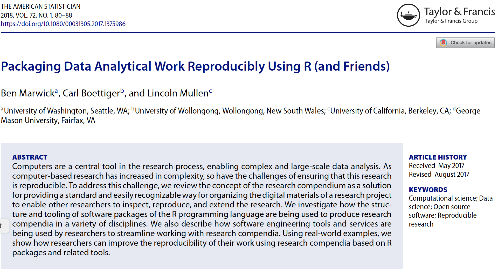
]

---
## Same code, different environment
.footnote[More advanced than we can cover today. See https://mybinder.org and https://hub.docker.com/ for more. ]

Code may not run somewhere else. People are working on that:
.right-column[
### Docker containers
#### packages up everything needed to run an application: code, runtime, system tools, system libraries and settings in a standalone, executable package.

### Binder
#### a service that provides your code and the hardware and software to execute it (mostly R, Python).
]

---
background-image: url(marwick-figs.png)
background-size: contain
class: center, top

.left[Can be done for any size project `r emo::ji("point_down")` ]

---
# When to share?

## Many options

## 

---
### Biased anecdote for benefits of sharing *with* paper submission
.pull-left[
"Thanks for the opportunity to review this interesting paper. It is exciting to see the FARS data used in this way. **It was also exciting that you shared your code and this allowed me to review your work in a way I have not done before.**"
.right[-Reviewer 1]
]

.pull-right[
"Overall verdict: This paper was both exciting and a pleasure to read. Clearly written, well argued, and with a highly commendable open science approach. As a referee, one frequently thinks 'why didn’t they report the results of a model with...' - and in this case **I was able to download the data, assess their code scripts, and run my own specification to see how it changed things**."
.right[-Reviewer 2]
]

.footnote[ We probably got lucky, but the [paper](https://osf.io/9yrdq/) was accepted on the first submission.]
---

.pull-left[
## Where to share?
Depends on discipline: find appropriate registry at http://www.re3data.org/, or check out ...

- [Harvard’s Dataverse](http://dataverse.harvard.edu)

- [Open Science Framework](http://osf.io)

- [OpenICPSR](https://www.openicpsr.org/openicpsr/)

- [figshare](https://figshare.com/)

- [Data Dryad](https://datadryad.org/stash)

- Many others...
]

.pull-right[
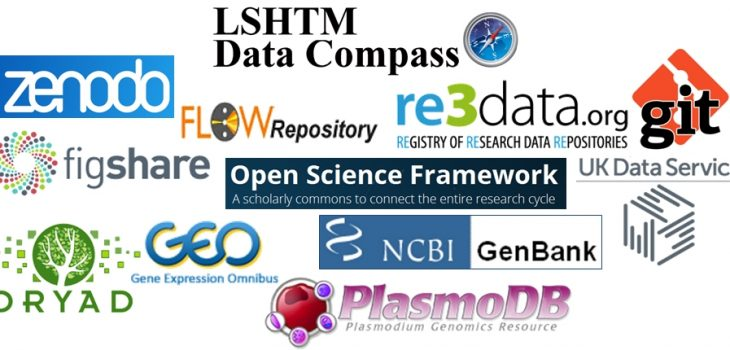
]

---
### Open Science Foundation
.pull-left[
OSF (http://osf.io) provides a central location to manage project files.

Any type of files can be uploaded (up to 5GB).

Most common file types will render to be viewed on OSF.

OSF also provides a more comprehensive system for planning, documenting, executing, and disseminating your research over the entire life cycle of a project--and beyond.
]

.pull-right[
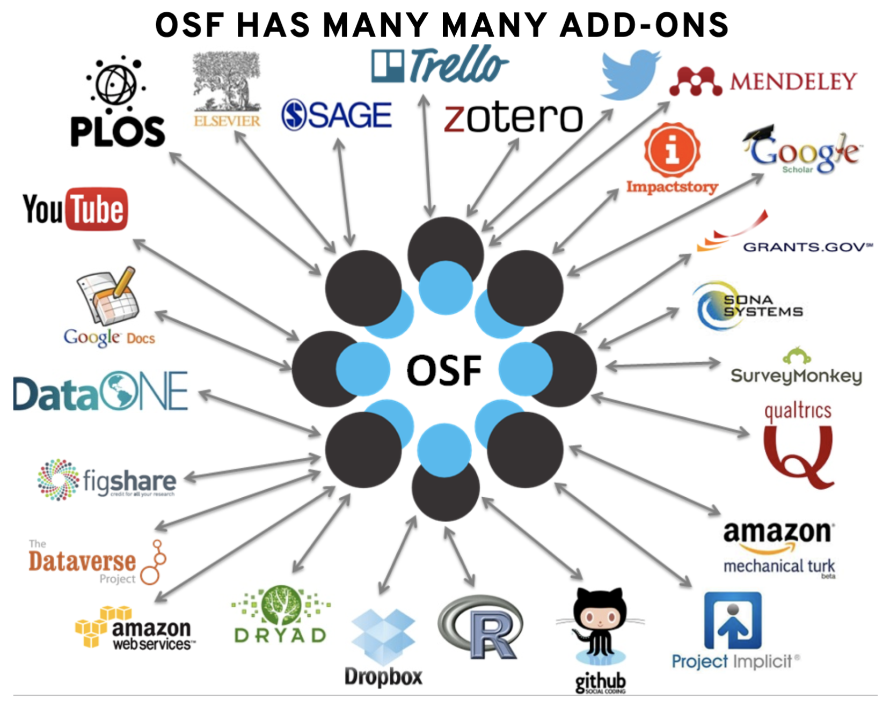
]

---
## OSF workflow
.pull-left[

### 1. Create a structured workspace.
### 2. (Possibly) pre-register study 
### 3. Deposit / add study materials.
### 4. Add and document analyses.
### 5. Share study data, materials, and code.
]

.pull-right[
.center[OSF project landing page
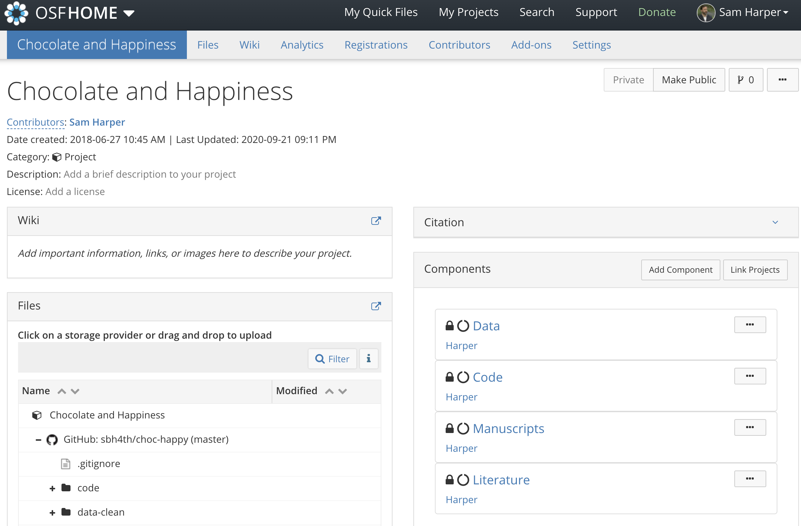
]]

---
### Manage access/permissions
.center[
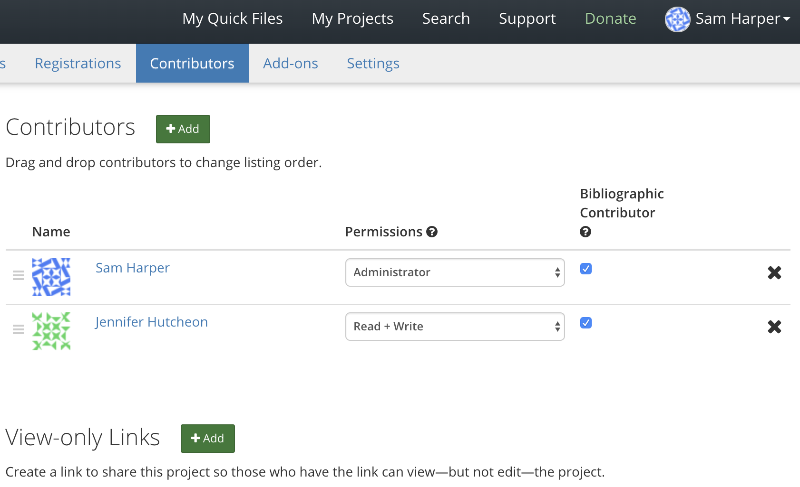
]

---
### Automate version control
.center[
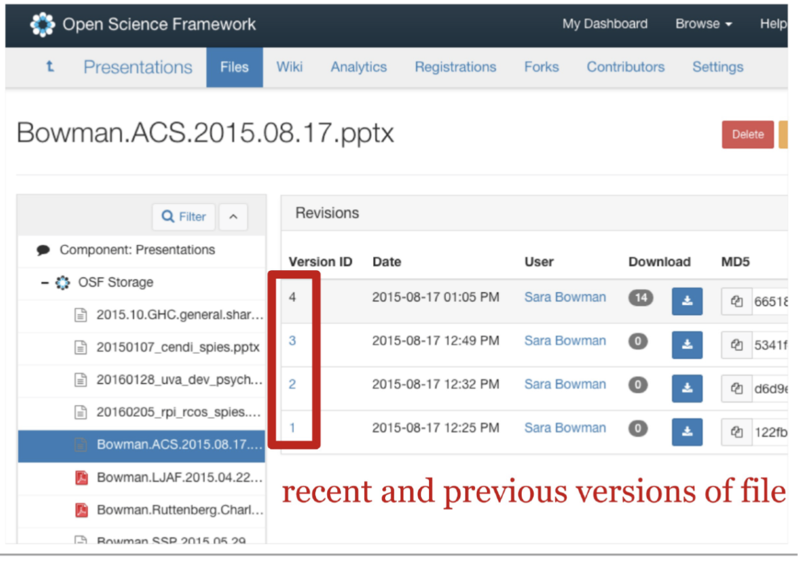
]

---
### Persistent, unique .red[identifiers] for published work
.center[
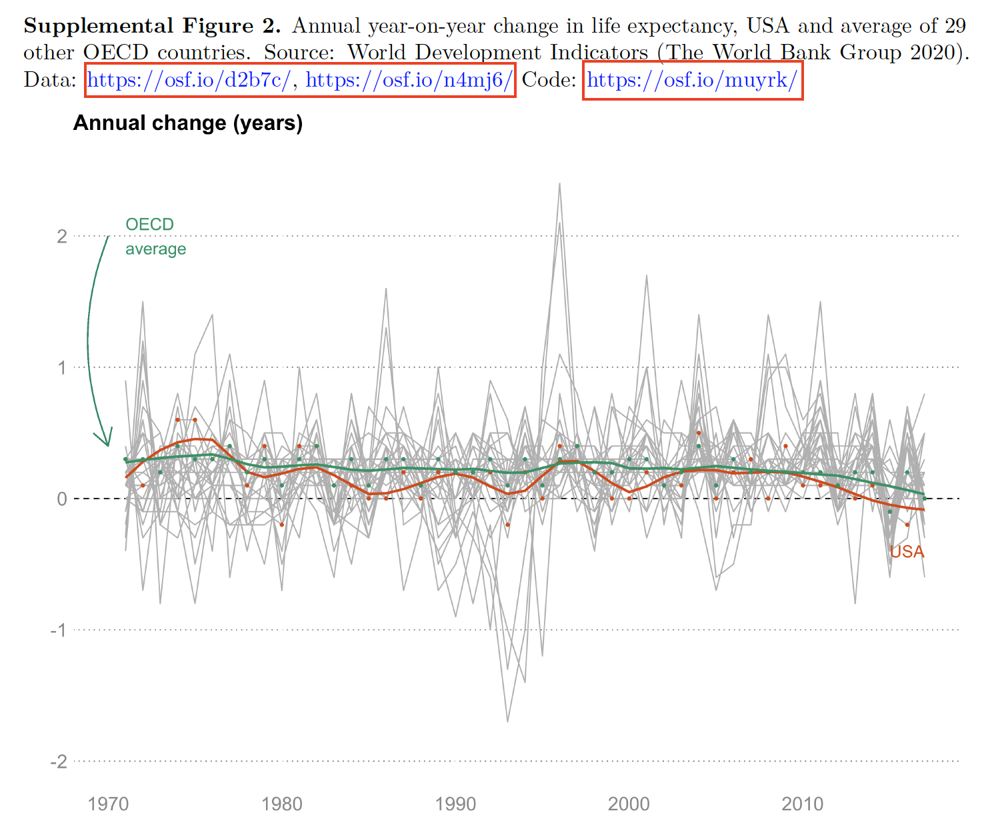
]
---
# Not everything can (or should) be shared
### Spectrum for sharing sensitive material:

.footnote[ Source: Jennifer Sturdy (https://osf.io/5yq4u/)]

---
.left-column[
## OSF allows both public and private components

Allows for maximum sharing without sacrificing privacy concerns.
]

.right-column[
.center[
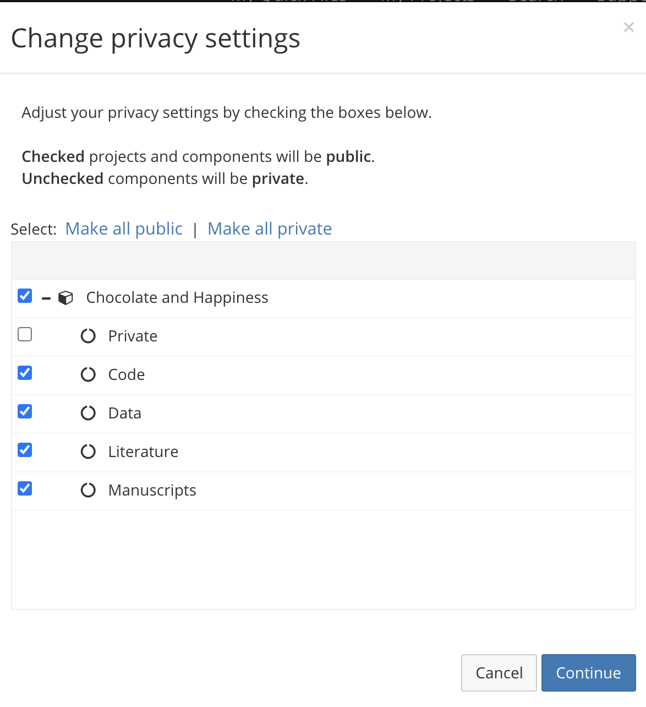
]]

---
# Why we worry (re-identification)
.footnote[Narayanan (2008)]

.pull-left[
### Netflix "contest" data:
- unique "random" ID
- film rated
- date
- `r emo::ji("star")` `r emo::ji("star")` `r emo::ji("star")`

But people rate in many places, some of which .red[do] contain personal data.
]

.pull-right[
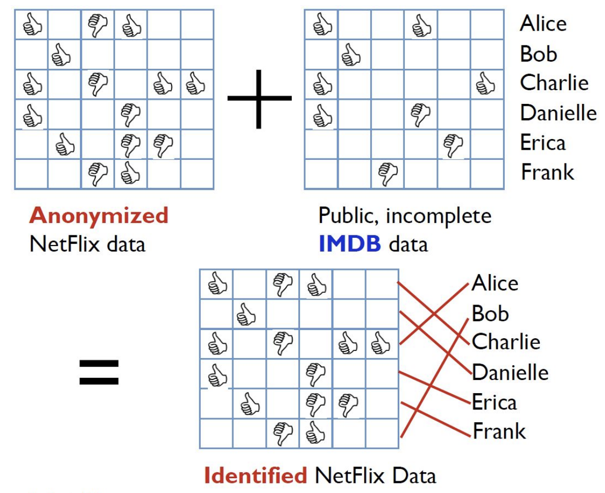
]

---
# Concerns about privacy
.right-column[
### Trade-offs
#### Can't pretend there aren't social costs to open data.

### Dangers of re-identification
#### Wealth of data after social media revolution.

### Limits
#### Solutions may be too severe to justify utility of sharing.
]
---
.pull-left[
## Synthetic data may also be possible

- mimics an original dataset, preserving its statistical properties and relationships between variables

- classification and regression tree approach

- 0% disclosure risk

- `synthpop` R package `r emo::ji("package")`

- code and materials on [GitHub](https://github.com/dsquintana/synthpop-primer)
]

.pull-right[
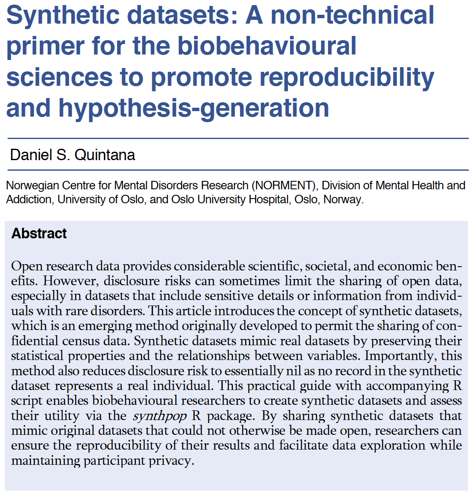
]

.footnote[ Quintana (2020)]

---
class: center, middle, inverse
# .orange[**5. Reproducible Example**]

---
class: middle, center
# Today's Research Project
## Does chocolate increase graduate student happiness?

---
background-image: url(choc-happy-design.png)
background-size: contain

---
.left-column[
### Example
- Folder structure

- Organizing via OSF

- Cleaning

- Analysis
  - Descriptives
  - Tables
  - Figures

- Write-up
]

.right-column[
.center[
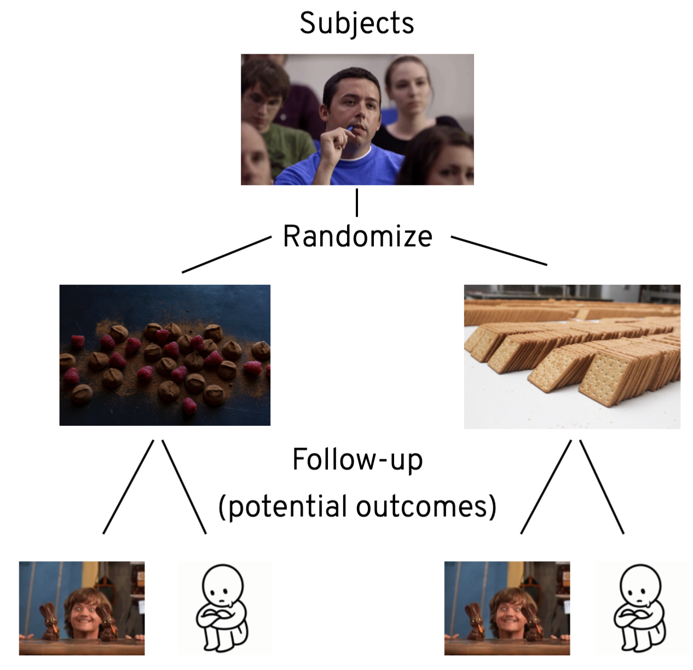
]]

---
class: left
### Folder structure
Separate code from data and manuscript:
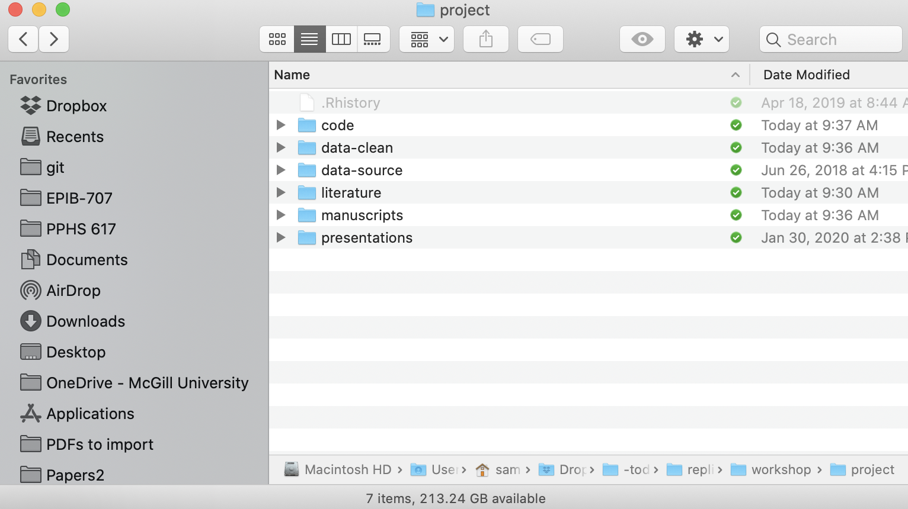
---
# Manuscript writing
Usually Word
- Good for collaborative writing (track changes)
- Not a reproducible format
- Numbers / estimates must be typed out
- Need to update tables and figures by hand

Use markdown instead

Collaborative writing online (Google docs, Authorea, Overleaf, etc.)

---
class: middle, center
# Live Demo
🙏

---
class: middle, center
# Final Thoughts

---
# Working with "friends"
.center[
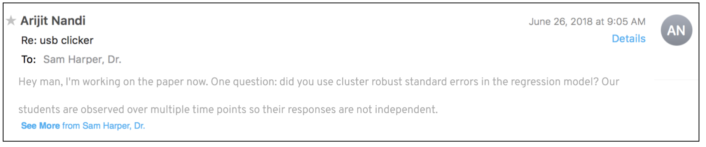
]
1. Ugh.
2. He's right.
2. Need to regenerate the model and table results.
- Do you know where your materials are?
- Is it 6 months later?
- Could someone else take over and figure out what you did?

---
# This seems like a lot of extra work.
.pull-left[
## What's in it for me?
Selfish reasons to work reproducibly:
- Helps to avoid disaster.
- Makes it easier to write papers.
- Can help reviewers
- Enables continuity of your work.
- Builds your scholarly reputation.
]

.pull-right[

]

.footnote[ Markowetz (2015)]

---
# Take home messages

.left-column[
.right[
# `r emo::ji("toolbox")`
.white[x]
# `r emo::ji("lock")`

.white[x]
# `r emo::ji("rocket")`
]]

.right-column[
### Reproducible $\neq$ rigid
#### Don't like *R*? Need to use SAS? There is no single set of tools--more important to find a workflow that works for **you**.

### Security still matters
#### Some things can't be shared. Providing a rationale for what is/not shared means being transparent.

### 3rd?
#### Is there anything left to say?
]

---
# Other resources for reproducibility in R
.footnote[Source: [Anna Krystalli](https://annakrystalli.me/talks/r-in-repro-research-dc.html#120)]
.pull-left[
Version Control
- [Happy Git and GitHub for the useR](https://happygitwithr.com/)

RMarkdown
- [R Markdown: The Definitive guide](https://bookdown.org/yihui/rmarkdown/)
- [RMarkdown Driven Development (RmdDD)](https://emilyriederer.netlify.com/post/rmarkdown-driven-development/): Blog post by Emily Riederer

R Packages
- [R packages](https://r-pkgs.org/) by Hadley Wickham and Jenny Bryan
]
.pull-right[
Research Compendia
- Karthik Ram: [_rstudio::conf 2019 talk_](https://github.com/karthik/rstudio2019)

Docker & Binder
- Getting started with binder [docs](https://mybinder.readthedocs.io/en/latest/introduction.html)
- rOpenSci [Docker tutorial](https://ropenscilabs.github.io/r-docker-tutorial/)

Tutorials
- [Rstudio Essentials](https://resources.rstudio.com/) Webinar series
- [rrresearch](https://annakrystalli.me/rrresearch/): ACCE DTP course on Research Data & Project Management
]
