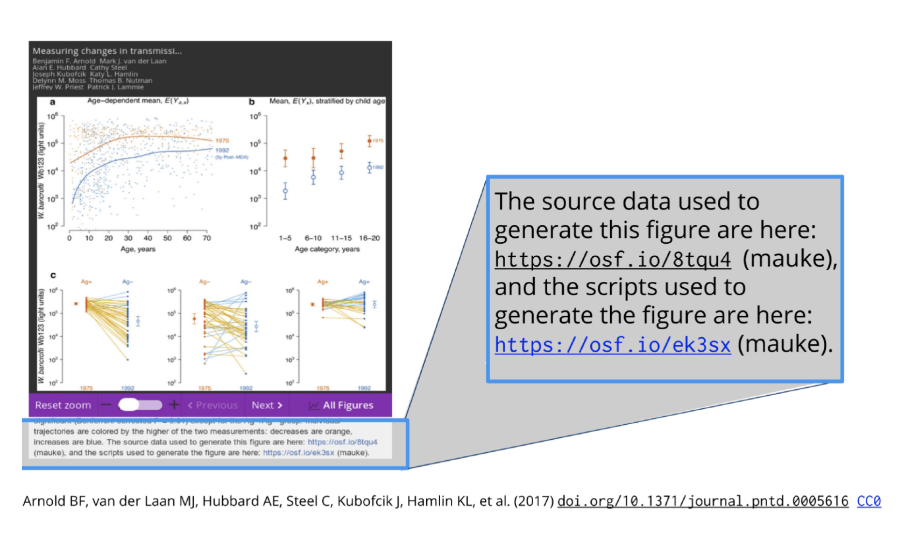

```{r setup, include=FALSE}
options(htmltools.dir.version = FALSE)
library(here)
library(DiagrammeR)
library(xaringan)
library(leaflet)
library(ggplot2)
library(emojifont)
library(emo) # devtools::install_github("hadley/emo")
xfun::pkg_load2(c('tikzDevice', 'magick', 'pdftools'))
```

```{r, include=FALSE}
pdf2png = function(path) {
  # only do the conversion for non-LaTeX output
  if (knitr::is_latex_output()) return(path)
  path2 = xfun::with_ext(path, "png")
  img = magick::image_read_pdf(path)
  magick::image_write(img, path2, format = "png")
  path2
}
```

```{r xaringan-themer, include=FALSE}
library(xaringanthemer)
style_xaringan(text_color = "#000000", header_color = "#737373", text_font_size = "24px",  text_font_family = "'Lucida Sans'", header_font_google = google_font("Source Sans Pro"), header_font_weight="lighter", title_slide_background_color =  "#ffffff", title_slide_text_color = "#000000", link_color = "#0000ee", footnote_font_size = "0.5em")
```

class: center, middle, inverse
# .orange[**4. Dissemination Solutions**]

---
class: center, middle

# Replication Files

---
# Replication files provide the 'recipe' for reproducing your results.


.right-column[
Should be complete but parsimonious. Don't over do it.

Run / reproduce results with minimal effort (1-click).

Be "literate" (human readable).

Protect confidential data.

There is no single, perfect way to organize or prepare files for replication.

Find a workflow that works well for you.
]

.footnote[ Clark (2017)]

---
# Step 1: Generate replication files
.left-column[
```{r, echo=F}
ggplot() + geom_fontawesome("fa-clone", color='#f5bc6c') + theme_void()
```
]

.right-column[
1. Create a new organized empty replication folder within your project directory (e.g., “replication_files/”)

2. Subfolders: Should be same as overall file structure:
 - .orange[code/] — scripts
  - .orange[data_clean/] — manipulated data
  - .orange[data_raw/] — original data
  - .orange[output/] — generated tables, graphs, etc.
  - .orange[extra/] — misc. extras (e.g., code book)

3. A “README.txt” file to document contents, sources, software/system versions, other info necessary for replication/comprehension.
]

.footnote[ Clark (2017)]

---
# Step 2: Replicate your own results

1. Copy data and code to your new replication directory.

2. After copying all of the relevant files, see if you can replicate the results in your paper.

3. May want to start with the "final" products (i.e., tables and figures from clean data), which should be "easiest" to replicate.

4. Check for errors and make sure all is well.

5. Now copy the original raw data and cleaning scripts and run the entire thing.

6. All good? If not, debug and try again.

.footnote[ Clark (2017)]

---
# Step 3: Final check
1. Shut down and restart software package.

2. Replicate again...all good?

3. Or have a friend / colleague try on another computer.

4. Fix any remaining bugs and try again.

5. Now ready to disseminate!

---
class: center, middle

# Code/Data Sharing

---
## Rationale for sharing
.pull-left[
Online repositories last longer, are indexed.

Concerns:

- Can usually be embargoed, or provide only what is necessary for replication (e.g., unused survey Qs).

- Biggest risk isn’t having your data/ideas stolen, it’s having your research ignored! (King 1995)

- *More* difficult if research products are proprietary.
]

.pull-right[
### Many resources to help

]

---
background-image: url(marwick-figs.png)
background-size: contain
class: center, top

.left[Can be done for any size project `r emo::ji("point_down")` ]
---

.pull-left[
## Where to deposit?
Depends on discipline: find appropriate registry at http://www.re3data.org/, or check out ...

- [Harvard’s Dataverse](http://dataverse.harvard.edu)

- [Open Science Framework](http://osf.io)

- [OpenICPSR](https://www.openicpsr.org/openicpsr/)

- [figshare](https://figshare.com/)

- [Data Dryad](https://datadryad.org/stash)

- Many others
]

.pull-right[

]

---
### Open Science Foundation
.pull-left[
OSF (http://osf.io) provides a central location to manage project files.

Any type of files can be uploaded (up to 5GB).

Most common file types will render to be viewed on OSF.

OSF also provides a more comprehensive system for planning, documenting, executing, and disseminating your research over the entire life cycle of a project--and beyond.
]

.pull-right[

]

---
.left-column[
### OSF steps
1. Create a structured workspace.
2. (Possibly) pre-register study 
3. Deposit / add study materials.
4. Add and document analyses.
5. Share study data, materials, and code.
]

.right-column[

]

---
.pull-left[
### Manage access/permissions

]

--

.pull-right[
### Automate version control

]

---
### Persistent identifiers for published work


---
# Spectrum for sharing sensitive material

.footnote[ Source: Jennifer Sturdy (https://osf.io/5yq4u/)]

---
.pull-left[
## Synthetic data may also be possible

- mimics an original dataset, preserving its statistical properties and relationships between variables

- classification and regression tree approach

- 0% disclosure risk

- `synthpop` R package

- code and materials on [GitHub](https://github.com/dsquintana/synthpop-primer)
]

.pull-right[

]

.footnote[ Quintana 2020]

---
class: center, middle, inverse
# .orange[**5. Reproducible Example**]

---
class: middle, center
# Today's Research Project
## Does chocolate increase graduate student happiness?

---
background-image: url(choc-happy-design.png)
background-size: contain

---
# Simple worked example
- Folder structure

- Organizing via OSF

- Cleaning

- Analysis
  - Descriptives
  - Tables
  - Figures

- Write-up

---
class: left
### Folder structure
Separate code from data and manuscript:

---
# Manuscript writing
Usually Word
- Good for collaborative writing (track changes)
- Not a reproducible format
- Numbers / estimates must be typed out
- Need to update tables and figures by hand

Use markdown instead

Collaborative writing online (Google docs, Authorea, Overleaf, etc.)

---
class: middle, center
# Live Demo
🙏

---
class: middle, center
# Final Thoughts

---
# Working with "friends"
.center[

]
1. Ugh.
2. He's right.
2. Need to regenerate the model and table results.
- Do you know where your materials are?
- Is it 6 months later?
- Could someone else take over and figure out what you did?

---
# This seems like a lot of extra work.
.pull-left[
## What's in it for me?
Selfish reasons to work reproducibly:
- Helps to avoid disaster.
- Makes it easier to write papers.
- Can help reviewers
- Enables continuity of your work.
- Builds your scholarly reputation.
]

.pull-right[

]

.footnote[ Markowetz (2015)]